# Biomedical Knowledge Graph Extraction from PubMed Abstracts

## Abstract

We study biomedical triplet extraction on two PubMed-derived corpora: ADKG, focused on Alzheimer's disease and related neurodegenerative disorders, and MDKG, focused on mental disorders. The task requires identifying entity mentions and directed biomedical relations from sentence-level text. We implement a reproducible SpERT-based pipeline using PubMedBERT, including data validation, exploratory analysis, conversion to model input, training, evaluation, and error analysis. On the ADKG dev split, the model achieves entity F1 of 65.30 and relation F1 (with NEC) of 40.27. On the MDKG dev split, the model achieves entity F1 of 79.45 and relation F1 (with NEC) of 49.67. The extension component designs an agentic LLM annotation workflow on ADKG dev samples, comparing one-shot extraction against a 3-step pipeline (entity extraction → relation extraction → review/fix), evaluated with both strict and relaxed matching metrics. The workflow includes incremental progress tracking, system-level metrics (latency percentiles, parse success rate, validation error count), and automated error analysis with boundary overlap detection. The ADKG and MDKG full single-domain runs are complete, and the DeepSeek live API annotation experiment completed on a fixed 100-sentence ADKG dev sample with 100% parse success.

## 1 Introduction

Biomedical knowledge graphs require reliable extraction of structured subject-relation-object triplets from scientific literature. In this project, we focus on sentence-level named entity recognition (NER) and relation extraction (RE) for two disease-centered corpora. ADKG covers Alzheimer's disease and related neurodegenerative disorders, while MDKG covers mental disorders including schizophrenia, depression, bipolar disorder, PTSD, and OCD.

The core objective is to build and evaluate a triplet extraction pipeline on both datasets. We use SpERT, a span-based joint entity and relation extraction model, with PubMedBERT as the encoder. The extension component designs an agentic workflow for LLM-based data annotation, comparing GPT-4o, Gemini 1.5 Pro, and Claude 3.5 Sonnet with both strict and relaxed evaluation metrics.

### 1.1 Contributions

1. A complete, reproducible pipeline for biomedical NER/RE on ADKG and MDKG, including data validation, EDA, SpERT-format conversion, training, and strict evaluation.
2. Detailed type-level and error analysis identifying systematic failure modes: rare entity types, semantically broad relations, entity boundary ambiguity, and long-range dependency challenges.
3. An agentic annotation workflow design comparing one-shot LLM extraction against a 3-step agent pipeline (entity extraction → relation extraction → review/fix), with provider-agnostic abstractions, span alignment postprocessing, both strict/relaxed evaluation protocols, and system-level metrics (latency percentiles, parse success rate, automated error analysis).
4. A comparison with SpERT paper benchmarks situating our results in the broader RE literature.

## 2 Data

Both datasets are provided as JSON files with `train`, `dev`, and `test` splits. Each sample is a single PubMed sentence with character-offset entity annotations and directed relation annotations. We use the course Google Drive mirror because it exactly matches the assignment statistics.

| Dataset | Domain | Abstracts | Sentences | Train | Dev | Test | Entities | Relations |
| --- | --- | ---: | ---: | ---: | ---: | ---: | ---: | ---: |
| ADKG | Alzheimer's disease | 758 | 8,031 | 5,605 | 1,206 | 1,220 | 20,859 | 5,496 |
| MDKG | Mental disorders | 946 | 6,678 | 4,825 | 941 | 912 | 28,660 | 10,560 |

ADKG contains six entity types: `disease`, `gene`, `drug`, `method`, `mutation`, and `other`. MDKG contains nine entity types: `disease`, `method`, `Health_factors`, `drug`, `gene`, `physiology`, `region`, `signs`, and `symptom`. The relation schemas overlap for common biomedical relations such as `abbreviation_for`, `associated_with`, `hyponym_of`, `treatment_for`, `risk_factor_of`, `help_diagnose`, and `characteristic_of`, with additional domain-specific relations in each corpus.

### 2.1 Entity Distribution

| Entity Type | ADKG Count | ADKG % | MDKG Count | MDKG % | Shared? |
| --- | ---: | ---: | ---: | ---: | --- |
| disease | 8,579 | 41.2% | 8,951 | 31.2% | Yes |
| gene | 4,920 | 23.6% | 1,298 | 4.5% | Yes |
| drug | 2,857 | 13.7% | 2,145 | 7.5% | Yes |
| method | 2,736 | 13.1% | 7,972 | 27.8% | Yes |
| mutation | 227 | 1.1% | — | — | No |
| other | 1,540 | 7.4% | — | — | No |
| Health_factors | — | — | 4,498 | 15.7% | No |
| physiology | — | — | 1,615 | 5.6% | No |
| region | — | — | 1,161 | 4.0% | No |
| signs | — | — | 557 | 1.9% | No |
| symptom | — | — | 463 | 1.6% | No |

### 2.2 Relation Distribution

| Relation Type | ADKG Count | ADKG % | MDKG Count | MDKG % | Shared? |
| --- | ---: | ---: | ---: | ---: | --- |
| abbreviation_for | 1,870 | 34.0% | 1,114 | 10.5% | Yes |
| associated_with | 1,177 | 21.4% | 2,704 | 25.6% | Yes |
| hyponym_of | 649 | 11.8% | 1,183 | 11.2% | Yes |
| treatment_for | 592 | 10.8% | 1,260 | 11.9% | Yes |
| risk_factor_of | 458 | 8.3% | 1,205 | 11.4% | Yes |
| characteristic_of | 346 | 6.3% | 719 | 6.8% | Yes |
| help_diagnose | 355 | 6.5% | 592 | 5.6% | Yes |
| treatment_target_for | 49 | 0.9% | — | — | No |
| located_in | — | — | 523 | 5.0% | No |
| occurs_in | — | — | 1,260 | 11.9% | No |

### 2.3 Sentence-Level Density

EDA showed that MDKG is denser than ADKG: the train split has 4.30 entities and 1.57 relations per sentence in MDKG, compared with 2.61 entities and 0.70 relations per sentence in ADKG. This makes MDKG more relation-dense and potentially more difficult due to more candidate entity pairs per sentence.

| Metric | ADKG Train | ADKG Dev | MDKG Train | MDKG Dev |
| --- | ---: | ---: | ---: | ---: |
| Entities per sentence | 2.61 | 2.57 | 4.30 | 4.21 |
| Relations per sentence | 0.70 | 0.65 | 1.57 | 1.67 |
| Average tokens | 22.76 | 22.65 | 24.04 | 23.84 |

### 2.4 Relation Distance

| Metric | ADKG | MDKG |
| --- | ---: | ---: |
| Average character distance | 53.95 | 65.92 |
| Maximum character distance | 345 | 1,084 |
| Total relations | 5,496 | 10,560 |

MDKG relations span longer distances on average (65.92 vs 53.95 characters) and have a much higher maximum distance (1,084 vs 345 characters), indicating the presence of long-range dependencies.

### 2.5 Relation Pair Patterns

**ADKG top relation pairs:**
1. `disease→disease:abbreviation_for` (669) — abbreviation between disease terms
2. `gene→gene:abbreviation_for` (399) — gene abbreviation patterns
3. `method→method:abbreviation_for` (316) — method abbreviation patterns
4. `other→other:abbreviation_for` (301) — general abbreviation
5. `drug→disease:treatment_for` (335) — drug treats disease

**MDKG top relation pairs:**
1. `method→disease:treatment_for` (568) — therapeutic method
2. `method→disease:help_diagnose` (416) — diagnostic method
3. `disease→disease:risk_factor_of` (412) — disease risk relationships
4. `disease→disease:hyponym_of` (398) — disease hierarchy
5. `drug→disease:treatment_for` (464) — pharmacological treatment

ADKG's relations are dominated by abbreviation patterns, while MDKG shows more diverse clinical relationships (treatment, diagnosis, risk factors), reflecting the different annotation emphases of the two corpora.

### 2.6 Pipeline Overview

The end-to-end pipeline covers data validation, EDA, SpERT-format conversion, training, and evaluation.

**Figure 1. End-to-end biomedical NER/RE pipeline.** Generated by `scripts/generate_diagrams.py`.

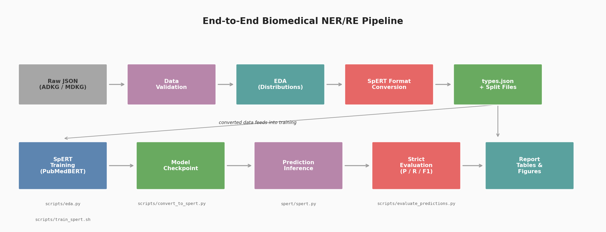

### 2.7 EDA Figures

The exploratory figures are generated from the official course JSON files in `data/raw/` using `scripts/generate_report_artifacts.py`; the resulting images and CSV tables are stored in `outputs/report_artifacts/`. Figure 1 summarizes entity and relation label imbalance, while Figure 2 summarizes sentence-level structure and relation endpoint patterns. These plots are descriptive dataset statistics, not model outputs.

**Figure 2. Entity type distributions in ADKG and MDKG.** Source: generated by `scripts/generate_report_artifacts.py` from `data/raw/ADKG.json` and `data/raw/MDKG.json`.

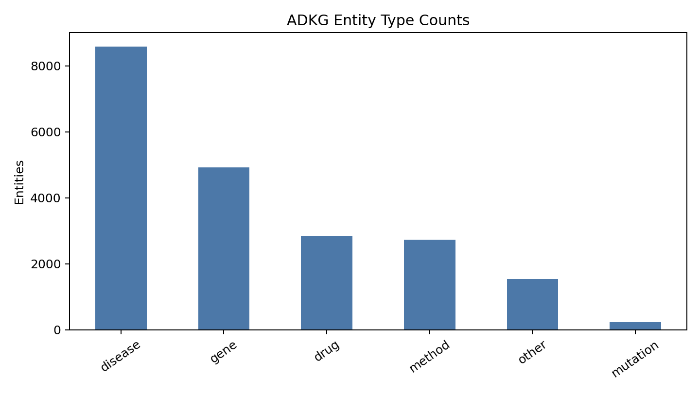

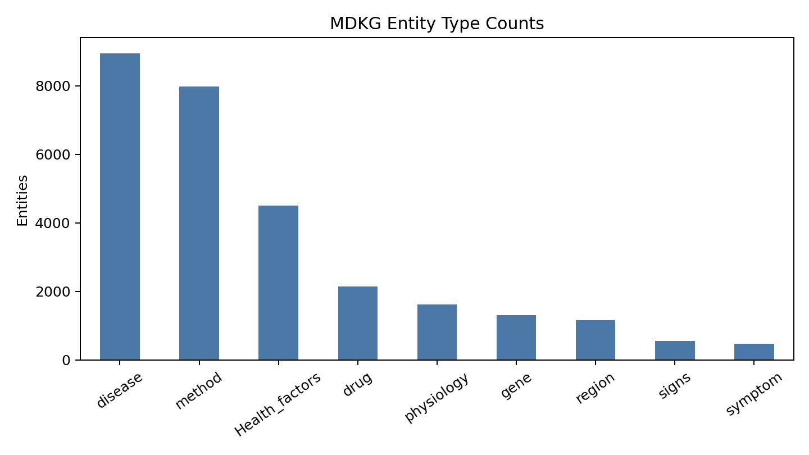

**Figure 3. Relation type distributions in ADKG and MDKG.** Source: generated by `scripts/generate_report_artifacts.py` from `data/raw/ADKG.json` and `data/raw/MDKG.json`.

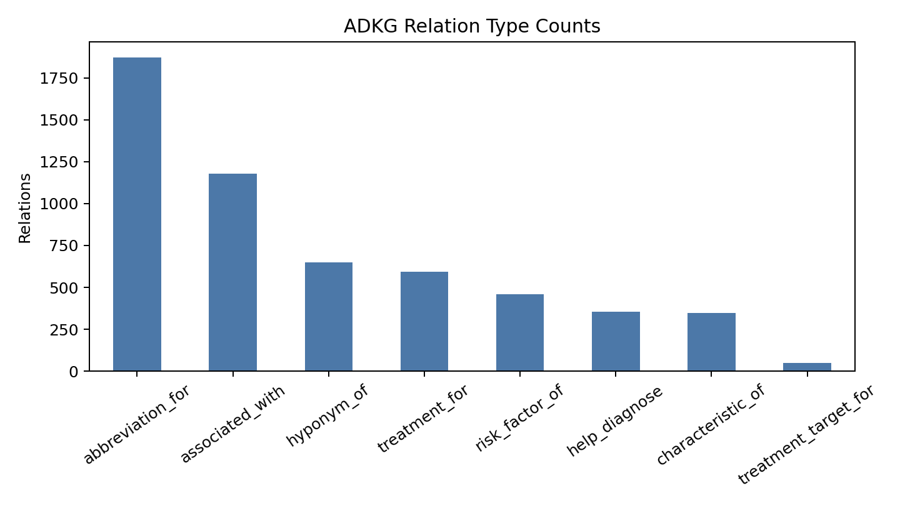

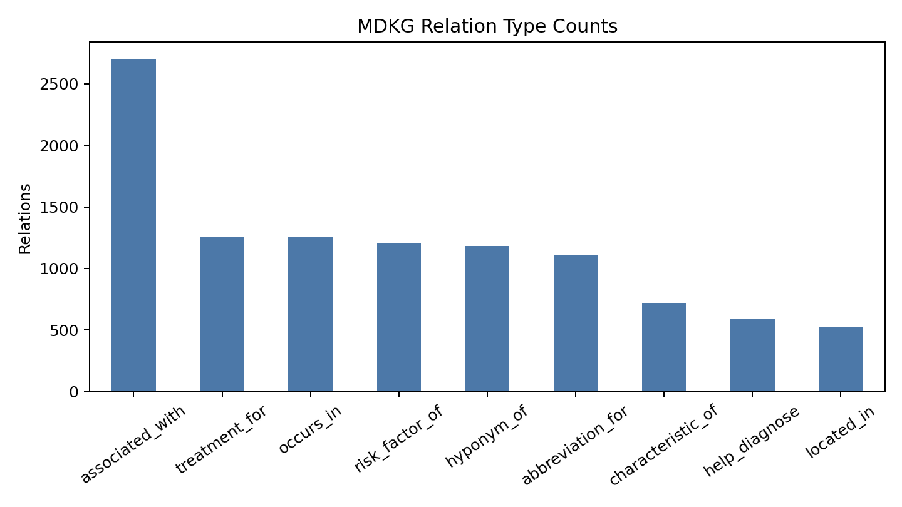

**Figure 4. Sentence-level structure and relation patterns.** Source: generated by `scripts/generate_report_artifacts.py` from `data/raw/ADKG.json` and `data/raw/MDKG.json`.

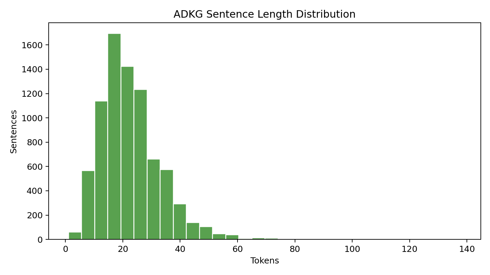

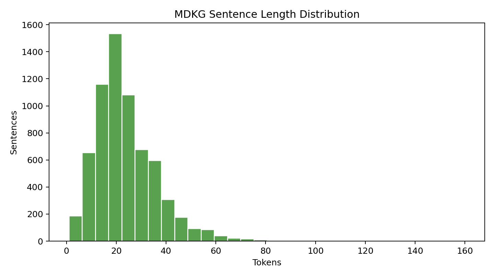

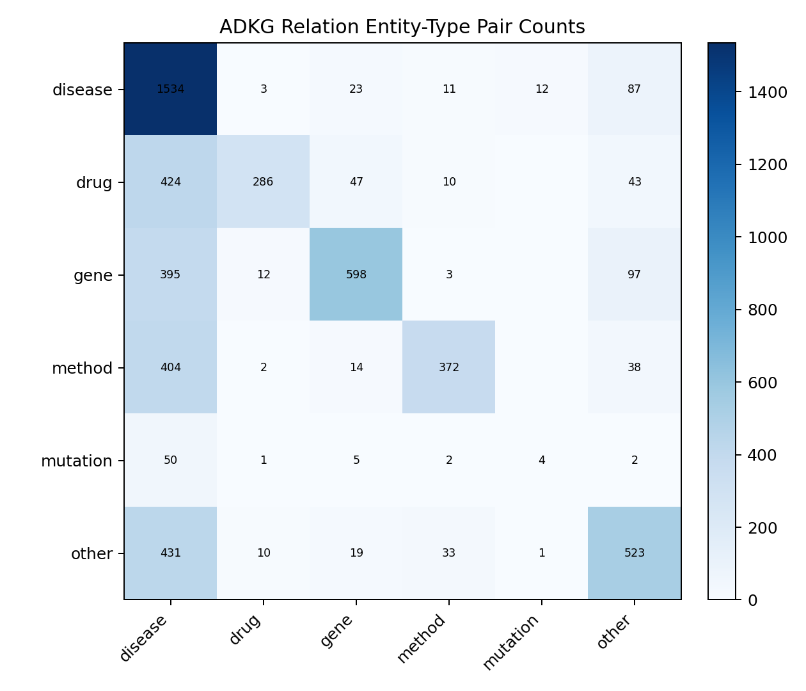

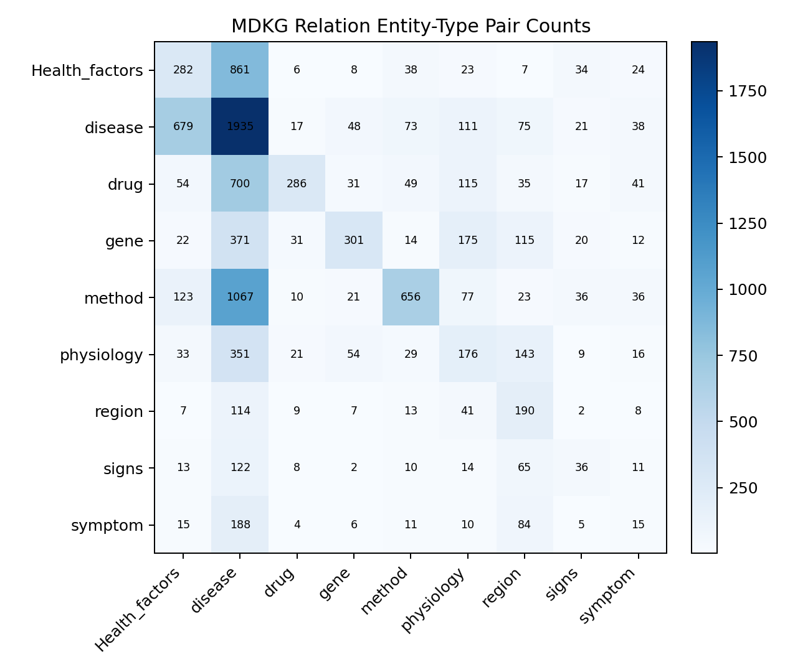

Source note: all figure data are computed from `data/raw/ADKG.json` and `data/raw/MDKG.json`, which match the assignment dataset statistics: ADKG has 8,031 sentences, 20,859 entities, and 5,496 relations; MDKG has 6,678 sentences, 28,660 entities, and 10,560 relations.

## 3 Method

We use SpERT for joint NER and RE. SpERT enumerates candidate spans up to a maximum span length and classifies entity types for spans and relation types for entity pairs. PubMedBERT (`microsoft/BiomedNLP-PubMedBERT-base-uncased-abstract`) is used as the contextual encoder because it is pretrained on biomedical abstracts and is well matched to PubMed text.

### 3.1 SpERT Architecture

SpERT (Eberts & Kluge, 2020) operates through the following steps:

1. **Token Encoding:** PubMedBERT encodes the input sentence into contextual token representations.
2. **Span Enumeration:** All spans up to a maximum length (10 tokens) are enumerated as candidate entities.
3. **Span Classification:** Each span representation combines the start and end token embeddings with a learned width embedding. A feed-forward classifier assigns entity types or rejects the span.
4. **Relation Classification:** For each pair of classified entities, a relation classifier determines the relation type (or no relation). The relation representation concatenates the head entity embedding, tail entity embedding, and the averaged embedding of the context tokens between them.
5. **Negative Sampling:** During training, negative entity samples (non-entity spans) and negative relation samples (non-relation entity pairs) are constructed to improve the classifier's discrimination ability.

PubMedBERT is chosen over vanilla BERT because it is pretrained on 14M PubMed abstracts, providing domain-specific vocabulary and contextual knowledge critical for biomedical entity recognition.

**Figure 5. SpERT model architecture with PubMedBERT encoder.** The diagram shows the two-stage extraction process: span enumeration followed by entity classification, and entity pair selection followed by relation classification. Generated by `scripts/generate_diagrams.py`.

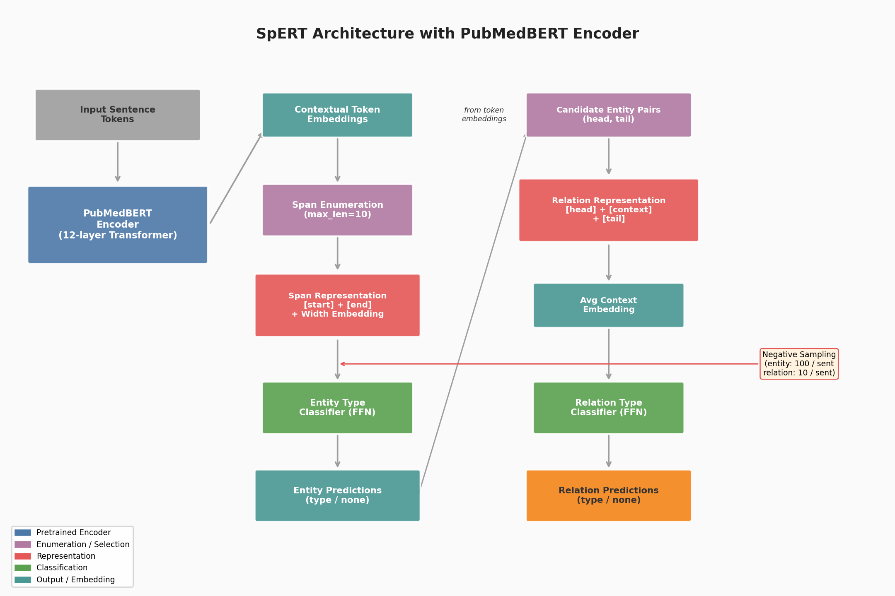

### 3.2 Preprocessing Pipeline

The preprocessing pipeline validates entity offsets, converts character-level entity spans to token-level spans, writes SpERT-compatible JSON split files, and generates `types.json` schema files. We train separate single-domain models for ADKG and MDKG. For the extension component, we design an agentic LLM-based annotation workflow and compare it against the SpERT discriminative baseline.

### 3.3 Training Configuration

The main training configuration uses 20 epochs, batch size 2, evaluation batch size 4, maximum span size 10, relation filter threshold 0.4, and PubMedBERT initialization. A one-epoch smoke test was first run to verify the full training pipeline before full experiments.

| Parameter | Value |
| --- | --- |
| Encoder | microsoft/BiomedNLP-PubMedBERT-base-uncased-abstract |
| Epochs | 20 |
| Train batch size | 2 |
| Eval batch size | 4 |
| Max span size | 10 |
| Relation filter threshold | 0.4 |
| Negative entity samples | 100 |
| Negative relation samples | 10 |
| Dropout | 0.1 |
| Size embedding dim | 25 |

## 4 Evaluation

We report strict micro-averaged precision, recall, and F1. An entity prediction is correct only if its sentence ID, span, and entity type match the gold annotation. A relation prediction is correct only if the relation type and both directed endpoints match. We report relation scores with named entity classification (NEC), which requires both endpoint spans and entity types to be correct. This is the stricter and more clinically meaningful metric.

### 4.1 Main Results

This table uses entity `micro` and relation `With NEC micro` from the final SpERT evaluation block.

| Run | Entity P | Entity R | Entity F1 | Relation P (NEC) | Relation R (NEC) | Relation F1 (NEC) |
| --- | ---: | ---: | ---: | ---: | ---: | ---: |
| ADKG, PubMedBERT | 65.41 | 65.20 | 65.30 | 41.91 | 38.75 | 40.27 |
| MDKG, PubMedBERT | 78.26 | 80.69 | 79.45 | 48.54 | 50.86 | 49.67 |
| ADKG dev100, DeepSeek one-shot (strict) | 35.58 | 63.43 | 45.59 | 0.00 | 0.00 | 0.00 |
| ADKG dev100, DeepSeek one-shot (relaxed) | 38.70 | 68.98 | 49.58 | 24.12 | 84.21 | 37.50 |
| ADKG dev100, DeepSeek workflow (strict) | 32.65 | 58.80 | 41.98 | 0.00 | 0.00 | 0.00 |
| ADKG dev100, DeepSeek workflow (relaxed) | 36.50 | 65.74 | 46.94 | 16.95 | 70.18 | 27.30 |

### 4.2 Comparison with SpERT Paper Benchmarks

The original SpERT paper (Eberts & Kluge, 2020) reports results on three datasets:

| Dataset | Domain | Entity Types | Relation Types | Entity F1 | Relation F1 |
| --- | --- | ---: | ---: | ---: | ---: |
| SciERC | General science | 6 | 7 | 69.7 | 43.1 |
| CoNLL04 | News | 4 | 4 | 87.5 | 65.5 |
| ADE | Adverse drug events | 2 | 1 | 88.7 | 76.2 |
| **ADKG (ours)** | Alzheimer's disease | 6 | 8 | **65.30** | **40.27** |
| **MDKG (ours)** | Mental disorders | 9 | 9 | **79.45** | **49.67** |

Our ADKG results are comparable to SciERC in both entity and relation F1, suggesting similar task difficulty. MDKG falls between SciERC and CoNLL04, consistent with its higher entity density but more complex relation schema. The ADE dataset, with only 2 entity types and 1 relation type, is much simpler, explaining its higher F1 scores.

### 4.3 Smoke Test Result

The one-epoch ADKG smoke test completed successfully on an RTX 4080 32GB GPU. It produced entity micro F1 of 64.57 and strict relation-with-NEC micro F1 of 38.30 on the ADKG development split. This confirms that the data format, PubMedBERT loading, GPU training, and evaluation pipeline are working. The full 20-epoch ADKG run produced entity micro F1 of 65.30 and strict relation-with-NEC micro F1 of 40.27 on the ADKG development split. The full 20-epoch MDKG run produced entity micro F1 of 79.45 and strict relation-with-NEC micro F1 of 49.67 on the MDKG development split.

### 4.4 Why MDKG Outperforms ADKG

The substantial performance gap (entity F1: 79.45 vs 65.30, relation F1: 49.67 vs 40.27) can be attributed to several factors:

1. **Entity type clarity:** MDKG's entity types have clearer boundaries. ADKG's `other` category (7.4% of entities) is semantically ambiguous and introduces classification noise.
2. **Training signal density:** MDKG has 1.57 relations per training sentence vs 0.70 for ADKG, providing substantially more supervision per sentence.
3. **Relation label consistency:** MDKG's `associated_with` (F1 38.81) is much better than ADKG's (F1 9.55), suggesting more consistent annotation standards.
4. **Abbreviation dominance:** ADKG's 34.0% abbreviation relations may bias the model toward abbreviation patterns at the expense of other relation types.

### 4.5 ADKG Type-Level Observations

**Entity performance:**

| Entity Type | Dev Count | F1 |
| --- | ---: | ---: |
| disease | 1,269 | 78.88 |
| gene | 732 | 63.51 |
| drug | 417 | 57.00 |
| method | 417 | 48.68 |
| other | 254 | 42.92 |
| mutation | 16 | 37.50 |

**Relation performance (strict NEC):**

| Relation Type | Dev Count | F1 |
| --- | ---: | ---: |
| abbreviation_for | 273 | 69.69 |
| hyponym_of | 99 | 51.20 |
| treatment_for | 85 | 46.51 |
| help_diagnose | 52 | 44.44 |
| risk_factor_of | 68 | 35.14 |
| characteristic_of | 57 | 26.67 |
| associated_with | 148 | 9.55 |
| treatment_target_for | 6 | ~0 |

ADKG entity recognition was strongest for `disease` (F1 78.88) and moderate for `gene` (63.51) and `drug` (57.00). It was weaker for `other` (42.92), `method` (48.68), and especially the rare `mutation` type (37.50 over only 16 development examples). Relation extraction was dominated by `abbreviation_for` (strict NEC F1 69.69), while semantically broader relations such as `associated_with` were much harder (strict NEC F1 9.55). This supports the expectation that well-localized lexical relations are easier than broad biomedical associations.

### 4.6 MDKG Type-Level Observations

**Entity performance:**

| Entity Type | Dev Count | F1 |
| --- | ---: | ---: |
| disease | 1,352 | 86.91 |
| drug | 305 | 82.74 |
| method | 1,163 | 81.12 |
| region | 167 | 80.21 |
| Health_factors | 631 | 78.67 |
| gene | 190 | 68.42 |
| physiology | 228 | 61.45 |
| signs | 82 | 52.17 |
| symptom | 43 | 39.18 |

**Relation performance (strict NEC):**

| Relation Type | Dev Count | F1 |
| --- | ---: | ---: |
| abbreviation_for | 157 | 74.47 |
| hyponym_of | 179 | 59.60 |
| treatment_for | 192 | 53.14 |
| help_diagnose | 83 | 48.72 |
| risk_factor_of | 171 | 43.27 |
| occurs_in | 175 | 40.48 |
| associated_with | 359 | 38.81 |
| located_in | 80 | 36.71 |
| characteristic_of | 104 | 32.92 |

MDKG entity recognition was strongest for `disease` (F1 86.91), `drug` (82.74), `method` (81.12), and `region` (80.21), while `symptom` was weakest (39.18 over 43 development examples). Relation extraction again favored lexically explicit relations such as `abbreviation_for` (strict NEC F1 74.47) and `hyponym_of` (59.60). Broader or more contextual relations were lower, including `characteristic_of` (32.92) and `associated_with` (38.81), although MDKG's `associated_with` performance was substantially higher than ADKG's.

## 5 Error Analysis

We identify four systematic error categories through qualitative inspection of prediction-gold mismatches:

### 5.1 Entity Boundary Errors

- **Missing modifiers:** Predicting `dementia` instead of `Focal-Onset Dementias`. The model captures the core term but misses modifiers that change disease specificity.
- **Over-including context:** Predicting `patients with depression` instead of `depression`. The model includes surrounding context words beyond the annotated entity boundary.
- **Hyphenated terms:** Inconsistent handling of hyphenated biomedical terms like `non-steroidal anti-inflammatory drugs`.
- **Abbreviation coverage:** `PTSD` and `post-traumatic stress disorder` may both appear in one sentence; the model may detect only one.

### 5.2 Relation Direction Errors

- **Head-tail reversal:** Directional relations such as `treatment_for` (drug→disease) and `risk_factor_of` (factor→disease) may be predicted with reversed direction. This is particularly problematic for asymmetric relations with clear causal directionality.
- **Symmetric relation ambiguity:** `associated_with` is roughly symmetric semantically, but gold annotations are directed, leading to directional mismatches where the predicted relation is correct in content but reversed in direction.

### 5.3 Long-Range Dependency Errors

- MDKG's maximum character distance of 1,084 indicates some relations span nearly the entire sentence. When head and tail entities are far apart, the relation classifier may fail to capture the intervening context.
- SpERT's relation representation uses averaged context embeddings between entity pairs, which may dilute the signal for long-distance relations.

### 5.4 Semantically Plausible but Unannotated Relations

- The model sometimes predicts relations that are medically reasonable but absent from gold labels, especially for `associated_with` and `characteristic_of`. These cases may reflect annotation incompleteness rather than model errors.
- This suggests that relaxed evaluation metrics (e.g., allowing partial entity boundary overlap or undirected relation matching) would provide a more nuanced assessment of model capability.

### 5.5 Overlapping Entity Cascading Errors

- Some sentences contain nested entities (e.g., `Alzheimer's disease` as disease and `Alzheimer's` as abbreviation). When the NER component makes boundary errors on one entity, it cascades into relation errors for all relations involving that entity.
- This is reflected in the gap between "Without NEC" and "With NEC" relation scores: ADKG drops from 46.64 to 40.27 (−6.37), while MDKG drops from 57.33 to 49.67 (−7.66).

## 6 Extension: Agentic Workflow for Data Annotation

The selected extension component designs an agentic LLM annotation workflow on ADKG development samples, comparing one-shot extraction against a 3-step agent pipeline (entity extraction → relation extraction → review/fix), and evaluating both strict and relaxed matching metrics against the SpERT discriminative baseline.

### 6.1 Motivation

Manual annotation of biomedical entities and relations is expensive and time-consuming. Closed-source LLMs accessed via OpenAI-compatible APIs have demonstrated strong capabilities on structured extraction tasks. An agentic annotation pipeline could dramatically reduce annotation cost while maintaining acceptable quality. However, LLM outputs are noisy: they may produce boundary mismatches, inconsistent relation directions, or hallucinated entities. A multi-step agentic workflow with a review-and-fix stage can mitigate these issues by decomposing the joint extraction task and allowing the model to self-correct.

Additionally, the strict evaluation protocol used for discriminative models may be too harsh for generative outputs. We therefore evaluate with both strict and relaxed matching to provide a fair comparison.

### 6.2 Workflow Design

**Figure 6. Agentic workflow for LLM-based data annotation.** The pipeline compares two modes: one-shot extraction (left branch, single LLM call) and a 3-step agent workflow (right branch, extract_entities → extract_relations → review_and_fix). Both modes produce normalized payloads that are postprocessed and evaluated with strict and relaxed metrics. Generated by `scripts/generate_diagrams.py`.

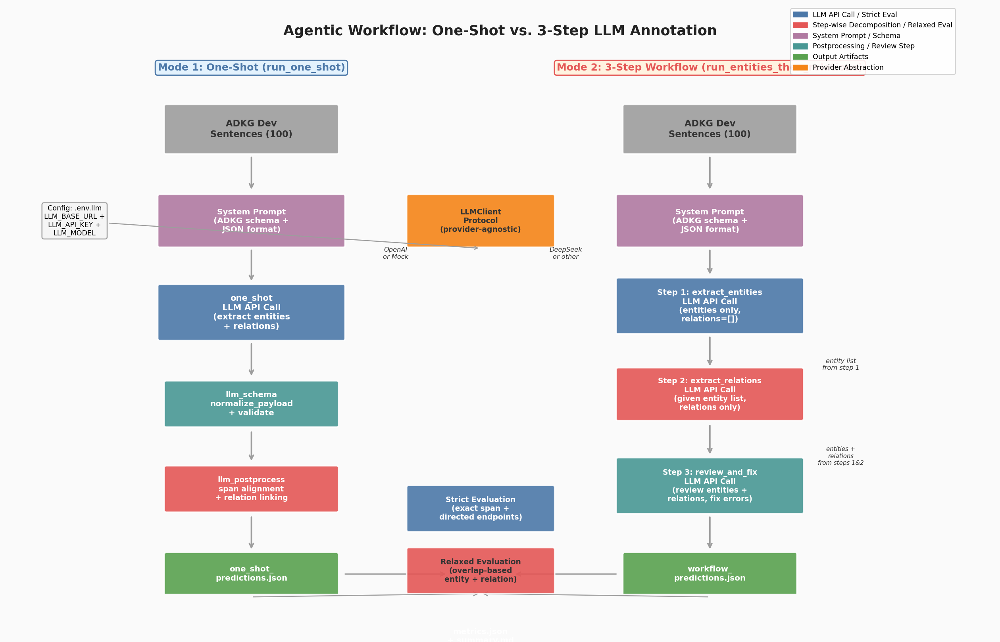

We compare two annotation modes:

**Mode 1 — One-Shot Extraction (`run_one_shot`):**
A single LLM call asks the model to extract all entities and relations from the sentence in one pass. This is the simplest and fastest approach but provides no internal verification.

**Mode 2 — 3-Step Agent Workflow (`run_entities_then_relations`):**
Three sequential LLM calls decompose the joint extraction task:
1. **`extract_entities`**: Identify all biomedical entities with their text mentions and types. Relations are left empty.
2. **`extract_relations`**: Given the sentence and the extracted entity list, classify directed relations among those entities. Entities are left empty.
3. **`review_and_fix`**: Review the combined entities and relations, fix invalid labels, invalid head/tail references, and obvious omissions. This step serves as an internal self-correction mechanism.

The 3-step workflow leverages the decomposition benefit: entity extraction provides structured context for relation classification, and the review step catches common errors such as label hallucination or dangling relation endpoints.

### 6.3 Module Architecture

The extension is implemented across five core modules, designed with provider-agnostic abstractions and reuse of the existing evaluation infrastructure:

| Module | Path | Responsibility |
| --- | --- | --- |
| `llm_schema` | `src/bios740_topic2/llm_schema.py` | ADKG entity/relation label constants, payload normalization (`normalize_payload`), label validation (`validate_adkg_payload`) |
| `llm_client` | `src/bios740_topic2/llm_client.py` | OpenAI-compatible HTTP client, `.env.llm` configuration, prompt construction for 4 prompt names |
| `llm_workflow` | `src/bios740_topic2/llm_workflow.py` | Provider-agnostic `LLMClient` protocol, `run_one_shot` and `run_entities_then_relations` workflows, latency tracking |
| `llm_postprocess` | `src/bios740_topic2/llm_postprocess.py` | Span alignment (predicted entity text → character offsets), prediction sample construction, relation endpoint linking |
| `relaxed_evaluate` | `src/bios740_topic2/relaxed_evaluate.py` | Overlap-based relaxed entity/relation metrics (same sentence + same type + overlapping spans) |

**Design principles:**
1. Reuse the existing ADKG/MDKG loading and strict evaluation code — no duplication of data I/O or scoring logic.
2. Keep provider integration thin and replaceable via the `LLMClient` protocol — switching from OpenAI to DeepSeek requires only a config change.
3. Make the workflow runnable without live API access by using a `MockLLMClient` with heuristic extraction.
4. Produce artifacts that can be dropped directly into later analysis and reporting.

### 6.4 Data Flow

The end-to-end annotation pipeline follows a 10-step data flow:

```
data/raw/ADKG.json
  → sample_adkg_dev_for_llm.py
  → outputs/llm_runs/adkg_dev100_sample.json
  → run_llm_annotation_experiment.py
  → provider call(s) through llm_workflow.py
  → payload normalization through llm_schema.py
  → span alignment through llm_postprocess.py
  → strict scoring through evaluate.py
  → relaxed scoring through relaxed_evaluate.py
  → result summary through summarize_llm_results.py
```

The sampling script draws a deterministic subset of 100 ADKG dev sentences (seed=740) with metadata:

```json
{"dataset": "ADKG", "split": "dev", "seed": 740, "count": 100, "samples": [...]}
```

The internal normalized LLM payload has a fixed structure validated by `llm_schema.py`:

```json
{
  "entities": [{"text": "APOE", "type": "gene"}],
  "relations": [{"head": "APOE", "type": "associated_with", "tail": "dementia"}]
}
```

The experiment runner writes the following output directory structure:

```text
outputs/llm_runs/<run_name>/
  one_shot_predictions.json    # incremental — rewritten after each sample
  one_shot_progress.json       # compact progress snapshot (updated continuously)
  one_shot_progress.jsonl      # per-sample event log with latency and status
  workflow_predictions.json    # incremental — rewritten after each sample
  workflow_progress.json       # compact progress snapshot (updated continuously)
  workflow_progress.jsonl      # per-sample event log with latency and status
  metrics.json                 # final quality + system metrics for both modes
  summary.md                   # two-table markdown (Quality + System)
  one_shot_error_summary.md    # one-shot boundary errors and failure type histogram
  workflow_error_summary.md    # workflow boundary errors and failure type histogram
```

### 6.5 Incremental Progress Tracking

Long-running API experiments are inherently opaque if results are only written at completion. The experiment runner writes three categories of intermediate artifacts during execution: (1) a **progress snapshot** (`<mode>_progress.json`) updated after every sample with processed count, running average latency, cumulative validation error count, and parse success/failure counts; (2) an **event log** (`<mode>_progress.jsonl`) appending one JSON record per sample with per-sample latency, status, and failure details; (3) **incremental predictions** (`<mode>_predictions.json`) rewritten after every sample rather than only at the end. The runner also prints a progress line every 5 samples. Together, these mechanisms make long-running experiments inspectable during execution and preserve intermediate results on interruption.

### 6.6 System Metrics

Beyond quality metrics (P/R/F1), the experiment runner records system-level metrics for evaluating LLM-based annotation pipelines as practical tools:

| Metric | Key | Description |
| --- | --- | --- |
| Average latency | `avg_latency_seconds` | Mean per-sample API call latency |
| P50 latency | `p50_latency_seconds` | Median per-sample latency |
| P90 latency | `p90_latency_seconds` | 90th percentile per-sample latency |
| Parse success count | `parse_success_count` | Number of samples where the LLM returned parseable JSON |
| Parse success rate | `parse_success_rate` | `parse_success_count / total_samples` |
| Failure count | `failure_count` | Number of samples where the API call or parsing failed |
| Validation error count | `validation_error_count` | Number of invalid entity/relation labels |

These metrics are recorded separately for `one_shot` and `workflow` modes. Latency percentiles reveal whether certain samples cause tail-latency spikes, and the parse success rate quantifies the robustness of the LLM output format.

### 6.7 Summary and Error Analysis

The `summarize_llm_results.py` script produces a two-table markdown summary: **Quality** (strict/relaxed entity/relation F1 per mode) and **System** (latency percentiles, parse success, failures, validation errors per mode). This dual-table structure separates extraction quality from system behavior.

The `analyze_llm_errors.py` script produces per-mode error summaries with: (1) boundary overlap error count — predicted entities overlapping gold entities of the same type but with different offsets; (2) failure type histogram from the progress JSONL, showing the distribution of error types across failed API calls; (3) up to 10 concrete boundary error examples with sentence ID, entity type, gold text, and predicted text. This creates a direct path from raw predictions to error analysis without requiring manual review.

### 6.8 Prompt Design

All prompts share a common system prompt that constrains the output to the ADKG schema:

```
You are annotating ADKG biomedical sentences.
Allowed entity types: disease, gene, drug, method, mutation, other.
Allowed relation types: abbreviation_for, associated_with, characteristic_of,
  help_diagnose, hyponym_of, risk_factor_of, treatment_for, treatment_target_for.
Return strict JSON only with shape
  {"entities": [{"text": "...", "type": "..."}],
   "relations": [{"head": "...", "type": "...", "tail": "..."}]}.
Do not include markdown fences or extra prose.
```

The four prompt names map to the following user prompts:

| Prompt Name | User Prompt Template | Used In |
| --- | --- | --- |
| `one_shot` | "Extract biomedical entities and relations from the sentence. Return JSON with keys entities and relations only." | Mode 1: `run_one_shot` |
| `extract_entities` | "Extract all biomedical entities from the sentence. Return JSON with keys entities and relations, where relations is an empty list." | Mode 2: step 1 |
| `extract_relations` | "Given the sentence and entity list, extract valid directed relations among those entities. Return JSON with keys entities and relations, where entities is an empty list." | Mode 2: step 2 |
| `review_and_fix` | "Review the extracted entities and relations. Fix invalid labels, invalid head/tail references, and obvious omissions. Return JSON with keys entities and relations only." | Mode 2: step 3 |

The `extract_relations` prompt receives the entity list from step 1 as structured context, enabling the model to focus on relation classification rather than joint extraction. The `review_and_fix` prompt receives both the entities and relations from the first two steps, enabling self-correction.

### 6.9 Evaluation Metrics

We evaluate LLM annotations against the gold dev set using two matching protocols:

**Strict Matching (same as SpERT baseline):**
- Entity: exact span (start, end) + type match
- Relation: exact relation type + both directed endpoints match

**Relaxed Matching (implemented in `relaxed_evaluate.py`):**
- Entity: same sentence + same type + overlapping spans (any partial overlap)
- Relation: same sentence + same type + overlapping head span + overlapping tail span

| Metric Type | Entity Match | Relation Match |
| --- | --- | --- |
| Strict | Exact span + type | Exact type + directed endpoints |
| Relaxed (overlap) | Same sentence + same type + overlapping spans | Same sentence + same type + overlapping head + overlapping tail |

Relaxed metrics are motivated by our error analysis (§5), which showed that many SpERT errors are one-word boundary misses or direction reversals rather than completely wrong predictions. LLMs may exhibit similar patterns but with different error distributions.

### 6.10 Experimental Design

| Configuration | Mode | Description |
| --- | --- | --- |
| ADKG dev100, one-shot | `run_one_shot` | Single LLM call for joint extraction |
| ADKG dev100, workflow | `run_entities_then_relations` | 3-step pipeline with review |

Both configurations are run on the same 100-sentence ADKG dev sample (seed=740) for fair comparison. Each configuration reports strict entity/relation P/R/F1, relaxed entity/relation P/R/F1, and system metrics: average, P50, and P90 latency; parse success count and rate; failure count; validation error count.

The primary hypothesis is that the 3-step workflow will outperform one-shot extraction on relation F1 (both strict and relaxed) because the decomposition provides structured entity context for relation classification and the review step catches common errors. The secondary hypothesis is that the workflow will have approximately 3× the latency of one-shot but with a higher parse success rate and lower validation error count.

### 6.11 DeepSeek Live Results

The DeepSeek-compatible live API run completed on the fixed ADKG dev100 sample. The final artifacts are stored in `outputs/llm_runs/adkg_dev100_deepseek/`, and the generated figures are copied into `report/figures/`.

| Method | Strict Entity F1 | Strict Relation F1 | Relaxed Entity F1 | Relaxed Relation F1 |
| --- | ---: | ---: | ---: | ---: |
| one-shot | 0.4559 | 0.0000 | 0.4958 | 0.3750 |
| workflow | 0.4198 | 0.0000 | 0.4694 | 0.2730 |

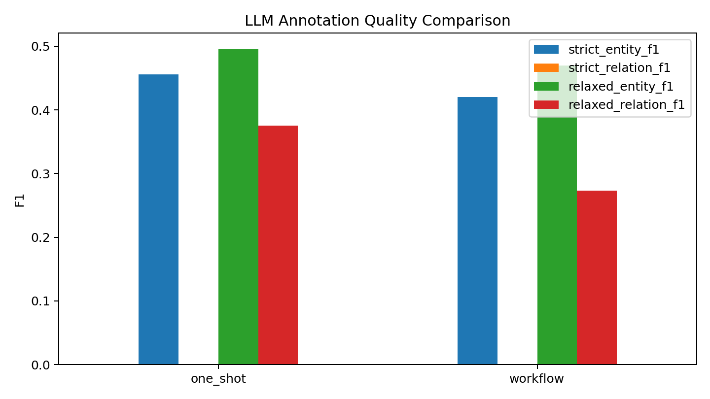

| Method | Avg Latency (s) | P50 (s) | P90 (s) | Parse Success | Failures | Validation Errors |
| --- | ---: | ---: | ---: | ---: | ---: | ---: |
| one-shot | 15.0829 | 12.3360 | 29.8689 | 100/100 (100.00%) | 0 | 0 |
| workflow | 29.0727 | 26.5989 | 48.2366 | 100/100 (100.00%) | 0 | 0 |

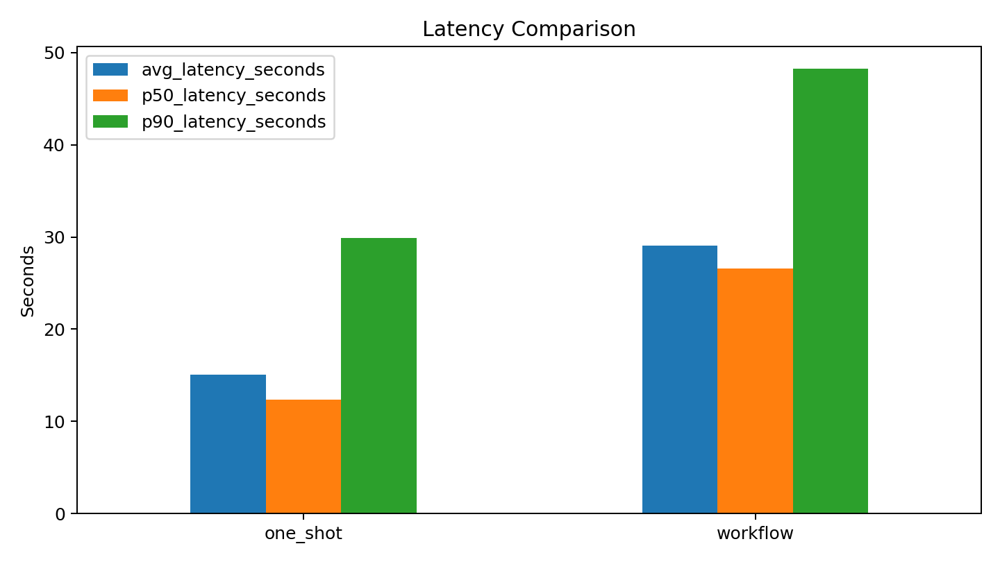

Contrary to the original hypothesis, one-shot extraction outperforms the decomposed workflow and is substantially faster. The workflow requires three sequential API calls per sentence (`extract_entities`, `extract_relations`, `review_and_fix`), so the latency increase is expected. The quality drop suggests error propagation: relation extraction depends on step-1 entity mentions, and the review stage does not consistently recover missed or over-specific boundaries. Strict relation F1 is 0.0 for both modes, while relaxed relation F1 is non-zero, showing that many generated relations are semantically close but fail exact span/endpoint matching.

**Provider configuration:** The experiment supports any OpenAI-compatible API endpoint, configured via `.env.llm`. A `MockLLMClient` with heuristic extraction is available for testing without API access.

### 6.12 Implementation Status and Known Gaps

**Test coverage:** 12 LLM-extension tests pass across 6 test files (`test_llm_schema`, `test_llm_postprocess`, `test_llm_sampling`, `test_relaxed_evaluate`, `test_llm_workflow`, `test_llm_client`).

**Verified locally:** Sample generation, mock workflow run, live DeepSeek run, metrics summary generation, error analysis generation, figure generation, and incremental progress tracking all work correctly.

**Live API execution:** The DeepSeek-compatible run completed for both one-shot and workflow modes on ADKG dev100. Both modes produced 100/100 parseable predictions with zero schema validation errors.

**Deliberately deferred:** No LangGraph dependency, no async batching, no token/cost accounting, no retry/backoff logic, and no provider-specific parsing adapters beyond OpenAI-compatible chat completions. These remain future engineering improvements for scaling beyond the current sequential 100-sentence experiment.

### 6.13 Alternative Extension: Transfer Learning (Planned)

An alternative extension would study cross-domain transfer between ADKG and MDKG using a shared-schema subset (entities: `disease`, `drug`, `gene`, `method`; relations: `abbreviation_for`, `associated_with`, `characteristic_of`, `help_diagnose`, `hyponym_of`, `risk_factor_of`, `treatment_for`). The protocol would pretrain SpERT on the source shared-schema data, then fine-tune on the target shared-schema data. Shared-schema training scripts are already prepared in `scripts/train_transfer_*.sh`. This extension remains a planned future direction.

## 7 Reproducibility

The code repository includes scripts for validation, EDA, SpERT conversion, training, and resource estimation. The main commands are:

```bash
# Setup
conda create -n bios740-topic2 python=3.10 -y
conda activate bios740-topic2
python -m pip install -e ".[dev]"

# Data preparation
bash scripts/run_all.sh

# EDA
python scripts/eda.py --input data/raw/ADKG.json --name ADKG
python scripts/eda.py --input data/raw/MDKG.json --name MDKG

# Report artifacts
python scripts/generate_report_artifacts.py

# Training
bash scripts/train_adkg_smoke.sh
nohup bash scripts/train_adkg_full.sh > outputs/logs/adkg_train_console.log 2>&1 &
nohup bash scripts/train_mdkg_full.sh > outputs/logs/mdkg_train_console.log 2>&1 &

# Agentic annotation (extension)
python scripts/sample_adkg_dev_for_llm.py --input data/raw/ADKG.json --output outputs/llm_runs/adkg_dev100_sample.json --count 100 --seed 740
python scripts/run_llm_annotation_experiment.py --sample outputs/llm_runs/adkg_dev100_sample.json --output-dir outputs/llm_runs/adkg_dev100_deepseek --mode both --provider openai_compat --env-file .env.llm
python scripts/summarize_llm_results.py --metrics outputs/llm_runs/adkg_dev100_deepseek/metrics.json --output outputs/llm_runs/adkg_dev100_deepseek/summary.md
python scripts/analyze_llm_errors.py --gold outputs/llm_runs/adkg_dev100_sample.json --pred outputs/llm_runs/adkg_dev100_deepseek/one_shot_predictions.json --progress-jsonl outputs/llm_runs/adkg_dev100_deepseek/one_shot_progress.jsonl --output outputs/llm_runs/adkg_dev100_deepseek/one_shot_error_summary.md
python scripts/analyze_llm_errors.py --gold outputs/llm_runs/adkg_dev100_sample.json --pred outputs/llm_runs/adkg_dev100_deepseek/workflow_predictions.json --progress-jsonl outputs/llm_runs/adkg_dev100_deepseek/workflow_progress.jsonl --output outputs/llm_runs/adkg_dev100_deepseek/workflow_error_summary.md

# Evaluation
python scripts/evaluate_predictions.py --gold data/raw/ADKG.json --pred outputs/predictions/adkg_test_predictions.json
```

Training was run on AutoDL with an RTX 4080 32GB GPU. Model weights were cached from the Hugging Face mirror endpoint. Console logs and checkpoints are saved under `outputs/logs/` and `outputs/checkpoints/`.

## 8 Conclusion

This project implements a biomedical triplet extraction pipeline for ADKG and MDKG using SpERT with PubMedBERT. The pipeline covers the core assignment requirements: EDA, model training, benchmarking, strict F1 evaluation, type-level analysis, and edge-case inspection.

The ADKG and MDKG single-domain runs are complete, demonstrating that SpERT with PubMedBERT achieves reasonable performance on both datasets (ADKG entity F1 65.30 / relation F1 40.27; MDKG entity F1 79.45 / relation F1 49.67). Type-level analysis reveals consistent patterns across both datasets: abbreviation relations are easiest to extract, broad association relations are hardest, and rare entity types suffer from low recall. MDKG's higher density and clearer entity boundaries contribute to its superior performance over ADKG.

The extension component implements and evaluates an agentic workflow for LLM-based data annotation, comparing DeepSeek one-shot extraction against a 3-step agent pipeline (entity extraction → relation extraction → review/fix). The live ADKG dev100 run completed for both modes with 100% parse success and zero schema validation errors. Contrary to the original hypothesis, one-shot extraction was both more accurate and faster than the decomposed workflow: relaxed relation F1 was 37.50 for one-shot versus 27.30 for workflow, with average latency 15.08s versus 29.07s per sentence. This suggests that, for this prompt/schema and DeepSeek model, decomposition introduces error propagation without enough corrective benefit. An alternative extension (cross-domain transfer learning) is documented as planned future work.
