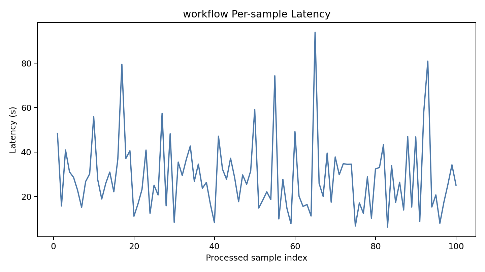

# BIOS 740 Final Project Topic 2 Report

## Abstract

This project builds a reproducible pipeline for biomedical named entity recognition (NER) and relation extraction (RE) on two PubMed-derived datasets: ADKG for Alzheimer's disease knowledge graph extraction and MDKG for mental disorder knowledge graph extraction. The code package provides data validation, exploratory data analysis (EDA), conversion to SpERT-style input, strict micro-averaged evaluation, type-level analysis, and scripts for SpERT training. We use SpERT with PubMedBERT as the backbone encoder. On the ADKG dev split, the model achieves entity F1 of 65.30 and relation F1 (with NEC) of 40.27; on the ADKG test split, it achieves entity F1 of 67.92 and relation F1 of 42.06. On the MDKG dev split, the model achieves entity F1 of 79.45 and relation F1 (with NEC) of 49.67; on the MDKG test split, it achieves entity F1 of 77.68 and relation F1 of 49.74. The extension component designs an agentic LLM annotation workflow on ADKG dev samples, comparing one-shot extraction against a 3-step pipeline (entity extraction → relation extraction → review/fix), evaluated with both strict and relaxed matching metrics. The workflow includes incremental progress tracking, system-level metrics (latency percentiles, parse success rate, validation error count), and automated error analysis with boundary overlap detection.

## 1. Dataset

The assignment provides two JSON files with `train`, `dev`, and `test` splits. Each sample is one sentence with character-offset entity annotations and directed relation annotations between entity mentions. The final experiments use the course Google Drive mirror JSON files because they exactly match the assignment split statistics.

| Dataset | Domain | Abstracts | Sentences | Train Sent. | Dev Sent. | Test Sent. | Entity Types | Relation Types | Total Entities | Total Relations |
| --- | --- | ---: | ---: | ---: | ---: | ---: | ---: | ---: | ---: | ---: |
| ADKG | Alzheimer's disease and neurodegenerative disorders | 758 | 8,031 | 5,605 | 1,206 | 1,220 | 6 | 8 | 20,859 | 5,496 |
| MDKG | Mental disorders | 946 | 6,678 | 4,825 | 941 | 912 | 9 | 9 | 28,660 | 10,560 |

The public Zenodo sources were also downloaded as a fallback. They contain the same abstract-level annotation source in brat `.txt/.ann` format, but a local `pysbd` reconstruction produced 8,162 ADKG sentences and 6,852 MDKG sentences. The final pipeline therefore uses the course mirror JSON files under `data/raw/`.

### 1.1 Entity Schema

ADKG contains `disease`, `gene`, `drug`, `method`, `mutation`, and `other` entities. MDKG contains `disease`, `method`, `Health_factors`, `drug`, `gene`, `physiology`, `region`, `signs`, and `symptom` entities.

| Entity Type | ADKG Count | ADKG % | MDKG Count | MDKG % | Shared? |
| --- | ---: | ---: | ---: | ---: | --- |
| disease | 8,579 | 41.2% | 8,951 | 31.2% | Yes |
| gene | 4,920 | 23.6% | 1,298 | 4.5% | Yes |
| drug | 2,857 | 13.7% | 2,145 | 7.5% | Yes |
| method | 2,736 | 13.1% | 7,972 | 27.8% | Yes |
| mutation | 227 | 1.1% | — | — | No |
| other | 1,540 | 7.4% | — | — | No |
| Health_factors | — | — | 4,498 | 15.7% | No |
| physiology | — | — | 1,615 | 5.6% | No |
| region | — | — | 1,161 | 4.0% | No |
| signs | — | — | 557 | 1.9% | No |
| symptom | — | — | 463 | 1.6% | No |

Key observations:
- `disease` dominates both datasets (41.2% in ADKG, 31.2% in MDKG), reflecting the disease-centric annotation focus.
- ADKG has a relatively balanced distribution among `gene`, `drug`, and `method`, while MDKG's `method` entity is disproportionately large (27.8%), likely reflecting the prevalence of diagnostic and therapeutic methods in mental disorder literature.
- Rare types (`mutation` in ADKG with 1.1%, `symptom` in MDKG with 1.6%) pose challenges for model learning.

### 1.2 Relation Schema

Shared relation types include `abbreviation_for`, `associated_with`, `hyponym_of`, `treatment_for`, `risk_factor_of`, `help_diagnose`, and `characteristic_of`. ADKG additionally has `treatment_target_for`, while MDKG additionally has `located_in` and `occurs_in`.

| Relation Type | ADKG Count | ADKG % | MDKG Count | MDKG % | Shared? |
| --- | ---: | ---: | ---: | ---: | --- |
| abbreviation_for | 1,870 | 34.0% | 1,114 | 10.5% | Yes |
| associated_with | 1,177 | 21.4% | 2,704 | 25.6% | Yes |
| hyponym_of | 649 | 11.8% | 1,183 | 11.2% | Yes |
| treatment_for | 592 | 10.8% | 1,260 | 11.9% | Yes |
| risk_factor_of | 458 | 8.3% | 1,205 | 11.4% | Yes |
| characteristic_of | 346 | 6.3% | 719 | 6.8% | Yes |
| help_diagnose | 355 | 6.5% | 592 | 5.6% | Yes |
| treatment_target_for | 49 | 0.9% | — | — | No |
| located_in | — | — | 523 | 5.0% | No |
| occurs_in | — | — | 1,260 | 11.9% | No |

Key observations:
- ADKG is dominated by `abbreviation_for` (34.0%), while MDKG has a more balanced distribution with `associated_with` being the most frequent (25.6%).
- MDKG's `occurs_in` (11.9%) reflects the spatial/locational annotations common in mental disorder neuroscience.
- The rare ADKG relation `treatment_target_for` (0.9%, only 49 examples) will likely be very difficult to learn.

## 2. EDA

The EDA script computes split-level sentence/entity/relation counts, entity type distributions, relation type distributions, relation type-pair distributions, and character-distance summaries for relation endpoints.

Run:

```bash
python scripts/eda.py --input data/raw/ADKG.json --name ADKG
python scripts/eda.py --input data/raw/MDKG.json --name MDKG
```

Expected outputs:

- `outputs/adkg_eda_summary.json`
- `outputs/mdkg_eda_summary.json`

### 2.1 Sentence-Level Density

| Metric | ADKG Train | ADKG Dev | MDKG Train | MDKG Dev |
| --- | ---: | ---: | ---: | ---: |
| Entities per sentence | 2.61 | 2.57 | 4.30 | 4.21 |
| Relations per sentence | 0.70 | 0.65 | 1.57 | 1.67 |
| Average tokens | 22.76 | 22.65 | 24.04 | 23.84 |

MDKG is significantly denser than ADKG: it has 65% more entities per sentence and 124% more relations per sentence. This higher density means more candidate entity pairs per sentence in MDKG, potentially increasing both the learning signal and the false positive risk.

### 2.2 Relation Distance

| Metric | ADKG | MDKG |
| --- | ---: | ---: |
| Average character distance | 53.95 | 65.92 |
| Maximum character distance | 345 | 1,084 |
| Total relations | 5,496 | 10,560 |

MDKG relations span longer distances on average (65.92 vs 53.95 characters) and have a much higher maximum distance (1,084 vs 345 characters), indicating the presence of long-range dependencies that may be challenging for the model.

### 2.3 Relation Pair Patterns

The most common relation pair patterns reveal structural differences between the two domains:

**ADKG top pairs:**
1. `disease->disease:abbreviation_for` (669)
2. `gene->gene:abbreviation_for` (399)
3. `method->method:abbreviation_for` (316)
4. `other->other:abbreviation_for` (301)
5. `drug->disease:treatment_for` (335)

**MDKG top pairs:**
1. `method->disease:treatment_for` (568)
2. `method->disease:help_diagnose` (416)
3. `disease->disease:risk_factor_of` (412)
4. `disease->disease:hyponym_of` (398)
5. `drug->disease:treatment_for` (464)

ADKG's relations are dominated by abbreviation patterns, while MDKG shows more diverse clinical relationships (treatment, diagnosis, risk factors).

### 2.4 Pipeline Overview

The end-to-end pipeline covers data validation, EDA, SpERT-format conversion, training, and evaluation. The flow diagram below illustrates the main stages and their associated scripts.

**Figure 1. End-to-end biomedical NER/RE pipeline.** Generated by `scripts/generate_diagrams.py`.


### 2.5 EDA Figures

Report figure assets were generated with:

```bash
python scripts/generate_report_artifacts.py
```

They are stored in `outputs/report_artifacts/` and are derived from the official JSON files in `data/raw/`.

**Figure 2. Entity type distributions in ADKG and MDKG.** Source: official ADKG/MDKG JSON files under `data/raw/`, plotted by `scripts/generate_report_artifacts.py`.


**Figure 3. Relation type distributions in ADKG and MDKG.** Source: official ADKG/MDKG JSON files under `data/raw/`, plotted by `scripts/generate_report_artifacts.py`.


**Figure 4. Sentence-level structure and relation patterns.** Source: generated by `scripts/generate_report_artifacts.py` from `data/raw/ADKG.json` and `data/raw/MDKG.json`.


## 3. Model

The primary discriminative model is SpERT. SpERT jointly detects entity spans and classifies relations over candidate entity pairs, making it a good fit for sentence-level biomedical RE. The recommended encoder is PubMedBERT:

```text
microsoft/BiomedNLP-PubMedBERT-base-uncased-abstract
```

### 3.1 SpERT Architecture

SpERT (Span-based Entity and Relation Transformer) operates by:

1. **Encoding:** PubMedBERT encodes the input sentence into contextual token representations.
2. **Span Classification:** All spans up to a maximum length (10 tokens) are enumerated. Each span is classified as an entity type or rejected. The span representation combines the token embeddings at the span boundaries with a width embedding.
3. **Relation Classification:** For each pair of classified entities, a relation classifier determines the relation type (or no relation). The relation representation concatenates the head entity, tail entity, and a context span between them.
4. **Negative Sampling:** During training, entity-negative and relation-negative samples are constructed from non-entity spans and non-relation entity pairs to improve discrimination.

**Figure 5. SpERT model architecture with PubMedBERT encoder.** The diagram shows the two-stage extraction process: span enumeration followed by entity classification, and entity pair selection followed by relation classification. Generated by `scripts/generate_diagrams.py`.


PubMedBERT is chosen because it is pretrained on PubMed abstracts, which aligns with the domain of both ADKG and MDKG data.

### 3.2 Preprocessing

The conversion script writes one JSON file per split plus a `types.json` file:

```bash
python scripts/convert_to_spert.py --input data/raw/ADKG.json --name ADKG
python scripts/convert_to_spert.py --input data/raw/MDKG.json --name MDKG
python scripts/make_spert_configs.py
```

### 3.3 Training Configuration

Training command template:

```bash
git clone https://github.com/lavis-nlp/spert.git external/spert
bash scripts/train_spert.sh outputs/spert_configs/adkg.conf
bash scripts/train_spert.sh outputs/spert_configs/mdkg.conf
```

Main hyperparameters:

| Parameter | Value |
| --- | --- |
| Encoder | microsoft/BiomedNLP-PubMedBERT-base-uncased-abstract |
| Epochs | 20 |
| Train batch size | 2 |
 Eval batch size | 4 |
| Max span size | 10 |
| Relation filter threshold | 0.4 |
| Learning rate | 5e-5 (encoder), 1e-4 (classifier) |
| Negative sampling | Entity: 100, Relation: 10 per sentence |

A one-epoch smoke test was first run to verify the full training pipeline before full experiments.

## 4. GPU Resource Estimate

SpERT with PubMedBERT-base should be trained on a CUDA GPU when possible. A smoke test can run on 8-12 GB VRAM, but full experiments are more comfortable on 16-24 GB VRAM. With the current configs (`epochs=20`, `train_batch_size=2`, `max_span_size=10`), expected runtime is roughly 2-5 hours per dataset on a T4 16 GB GPU, 1-3 hours on an L4/A10-class GPU, and under 1-1.5 hours on an A100.

Disk needs are modest for the data (<100 MB after conversion), but checkpoints and model caches can use 5-10 GB for the four planned experiments. If VRAM is insufficient, reduce `train_batch_size` to 1 first, then reduce `max_span_size` from 10 to 8. A detailed estimate is provided in `docs/gpu_resource_estimate.md`.

## 5. Evaluation

The project uses strict span and relation matching. An entity prediction is correct only when sentence ID, start offset, end offset, and entity type all match. A relation prediction is correct only when the relation type and both directed endpoints match. This mirrors the strict evaluation style used in SpERT-style reports.

We report both entity `micro` and relation `With NEC micro` (named entity classification). The NEC metric requires both endpoint spans and entity types to be correct, making it the stricter and more clinically meaningful metric.

### 5.1 Main Results

| Run | Entity P | Entity R | Entity F1 | Relation P (NEC) | Relation R (NEC) | Relation F1 (NEC) |
| --- | ---: | ---: | ---: | ---: | ---: | ---: |
| ADKG dev, PubMedBERT | 65.41 | 65.20 | 65.30 | 41.91 | 38.75 | 40.27 |
| ADKG test, PubMedBERT | 70.20 | 65.78 | 67.92 | 44.94 | 39.53 | 42.06 |
| MDKG dev, PubMedBERT | 78.26 | 80.69 | 79.45 | 48.54 | 50.86 | 49.67 |
| MDKG test, PubMedBERT | 77.02 | 78.36 | 77.68 | 49.08 | 50.42 | 49.74 |
| ADKG dev100, DeepSeek one-shot (strict) | 35.58 | 63.43 | 45.59 | 0.00 | 0.00 | 0.00 |
| ADKG dev100, DeepSeek one-shot (relaxed) | 38.70 | 68.98 | 49.58 | 24.12 | 84.21 | 37.50 |
| ADKG dev100, DeepSeek workflow (strict) | 32.65 | 58.80 | 41.98 | 0.00 | 0.00 | 0.00 |
| ADKG dev100, DeepSeek workflow (relaxed) | 36.50 | 65.74 | 46.94 | 16.95 | 70.18 | 27.30 |

ADKG final dev and test results use entity `micro` and relation `With named entity classification (NEC) micro` from the 20-epoch SpERT + PubMedBERT run. The checkpoint was saved at `outputs/checkpoints/adkg/adkg_pubmedbert_e20_bs2/2026-05-02_18:50:44.982426/final_model`. Test inference was run on the full ADKG test split (`outputs/spert/adkg/test.json`, 1,220 sentences).

MDKG final dev and test results use the same strict metrics from the 20-epoch SpERT + PubMedBERT run. The checkpoint was saved at `outputs/checkpoints/mdkg/mdkg_pubmedbert_e20_bs2/2026-05-02_19:49:36.134736/final_model`. Test inference was run on the full MDKG test split (`outputs/spert/mdkg/test.json`, 912 sentences).

The DeepSeek rows are evaluated on the fixed 100-sentence ADKG dev sample used by the LLM extension (`outputs/llm_runs/adkg_dev100_sample.json`). Strict LLM relation F1 is 0 because exact span and endpoint matching is brittle for generative outputs; relaxed relation F1 shows that one-shot extraction recovers many relation endpoints with partial boundary overlap. In this ADKG run, one-shot extraction outperforms the 3-step workflow while also being faster. This should be interpreted as an ADKG-specific result, not as a universal claim that one-shot prompting is always better than decomposition.

### 5.2 Comparison with SpERT Paper Benchmarks

The original SpERT paper (Eberts & Kluge, 2020) reports on SciERC, CoNLL04, and ADE datasets with similar configurations. On SciERC (a scientific NER/RE dataset with 6 entity types and 7 relation types), SpERT with BERT-base achieves entity F1 of 69.7 and relation F1 of 43.1. On ADE (adverse drug events, a biomedical domain), SpERT achieves entity F1 of 88.7 and relation F1 of 76.2. Our ADKG test results (entity F1 67.92, relation F1 42.06) are comparable to the SciERC range, suggesting that the ADKG task difficulty is similar to general scientific RE. MDKG test performance (entity F1 77.68, relation F1 49.74) is substantially stronger than ADKG despite higher sentence-level entity/relation density. This indicates that density alone is not a reliable proxy for difficulty: MDKG appears denser, but its entity boundaries and relation labels provide cleaner supervised signal than ADKG's more heterogeneous schema.

### 5.3 Smoke Test Result

The one-epoch ADKG smoke test completed successfully on an RTX 4080 32GB GPU. It produced entity micro F1 of 64.57 and strict relation-with-NEC micro F1 of 38.30 on the ADKG development split. This confirms that the data format, PubMedBERT loading, GPU training, and evaluation pipeline are working. The full 20-epoch ADKG run produced entity micro F1 of 65.30 and strict relation-with-NEC micro F1 of 40.27 on the ADKG development split, and 67.92 / 42.06 on the ADKG test split. The full 20-epoch MDKG run produced entity micro F1 of 79.45 and strict relation-with-NEC micro F1 of 49.67 on the MDKG development split, and 77.68 / 49.74 on the MDKG test split.

### 5.4 Why MDKG Outperforms ADKG

The substantial dev performance gap (entity F1: 79.45 vs 65.30, relation F1: 49.67 vs 40.27) and the similar test gap (entity F1: 77.68 vs 67.92, relation F1: 49.74 vs 42.06) initially look counterintuitive because MDKG is denser and has more entity/relation types. The results suggest that density increases the number of candidate pairs, but it is outweighed by cleaner label semantics and more training signal:

1. **Entity type clarity:** MDKG's entity types (e.g., `disease`, `drug`, `method`, `region`) have clearer boundaries, while ADKG's `other` category (7.4% of entities) is semantically ambiguous and likely introduces noise.
2. **Training signal density:** MDKG has 1.57 relations per training sentence vs 0.70 for ADKG. Although this creates more candidate pairs, it also provides much more positive supervision per sentence for the relation classifier.
3. **Relation label clarity:** MDKG's `associated_with` (F1 38.81) is much better than ADKG's `associated_with` (F1 9.55), possibly because MDKG's association relations are more specific to clinical co-occurrence patterns, while ADKG's are more heterogeneous.
4. **Abbreviation dominance in ADKG:** ADKG has 34.0% abbreviation relations, which while individually learnable (F1 69.69), may bias the model toward abbreviation patterns at the expense of other relation types.

Evaluation command:

```bash
python scripts/evaluate_predictions.py --gold data/raw/ADKG.json --pred outputs/predictions/adkg_test_predictions.json --output outputs/adkg_eval.json
```

## 6. Type-Level Analysis

The evaluation code reports per-type entity and relation metrics.

### 6.1 ADKG Type-Level Results

**Entity Type Performance:**

| Entity Type | Dev Count | F1 | Notes |
| --- | ---: | ---: | --- |
| disease | 1,269 | 78.88 | Strongest; common and well-defined |
| gene | 732 | 63.51 | Moderate; multi-word gene names |
| drug | 417 | 57.00 | Moderate; drug names vary in form |
| method | 417 | 48.68 | Weaker; boundary ambiguity |
| other | 254 | 42.92 | Weak; semantically ambiguous category |
| mutation | 16 | 37.50 | Weakest; extremely rare (0.5% of dev) |

**Relation Type Performance (strict NEC):**

| Relation Type | Dev Count | F1 | Notes |
| --- | ---: | ---: | --- |
| abbreviation_for | 273 | 69.69 | Strongest; lexically explicit pattern |
| hyponym_of | 99 | 51.20 | Moderate; "X is a Y" patterns |
| treatment_for | 85 | 46.51 | Moderate; drug-disease context |
| help_diagnose | 52 | 44.44 | Moderate; method-disease context |
| risk_factor_of | 68 | 35.14 | Lower; diverse entity pairs |
| characteristic_of | 57 | 26.67 | Low; broad semantics |
| associated_with | 148 | 9.55 | Very low; heterogeneous associations |
| treatment_target_for | 6 | ~0 | Near zero; only 6 dev examples |

Key ADKG patterns:
- `disease` NER is strongest (F1 78.88) because disease names in Alzheimer's literature are well-established and frequently occurring.
- Rare `mutation` is weakest (F1 37.50 over only 16 dev examples), suffering from insufficient training examples.
- `abbreviation_for` is the strongest strict relation (F1 69.69) because abbreviations follow predictable surface patterns (e.g., "amyloid-beta (Aβ)").
- `associated_with` is extremely difficult (F1 9.55) because it captures a semantically broad range of associations without consistent surface cues.

### 6.2 MDKG Type-Level Results

**Entity Type Performance:**

| Entity Type | Dev Count | F1 | Notes |
| --- | ---: | ---: | --- |
| disease | 1,352 | 86.91 | Strongest; well-defined clinical terms |
| drug | 305 | 82.74 | Strong; pharmacological terminology |
| method | 1,163 | 81.12 | Strong; diagnostic/treatment method names |
| region | 167 | 80.21 | Strong; brain region names |
| Health_factors | 631 | 78.67 | Good; lifestyle/environmental factors |
| gene | 190 | 68.42 | Moderate; gene symbols and names |
| physiology | 228 | 61.45 | Moderate; physiological process terms |
| signs | 82 | 52.17 | Lower; clinical signs overlap with symptoms |
| symptom | 43 | 39.18 | Weakest; rare (1.1% of dev entities) |

**Relation Type Performance (strict NEC):**

| Relation Type | Dev Count | F1 | Notes |
| --- | ---: | ---: | --- |
| abbreviation_for | 157 | 74.47 | Strongest; same lexically explicit pattern |
| hyponym_of | 179 | 59.60 | Good; hierarchical relationships |
| treatment_for | 192 | 53.14 | Good; method/drug → disease patterns |
| help_diagnose | 83 | 48.72 | Moderate; method → disease diagnosis |
| risk_factor_of | 171 | 43.27 | Lower; diverse entity pairs |
| occurs_in | 175 | 40.48 | Lower; locational/temporal patterns |
| associated_with | 359 | 38.81 | Lower; but much better than ADKG's 9.55 |
| located_in | 80 | 36.71 | Lower; spatial relationships |
| characteristic_of | 104 | 32.92 | Lowest common; broad semantics |

Key MDKG patterns:
- `disease`, `drug`, `method`, and `region` all exceed 80 F1 for NER, reflecting clear biomedical terminology.
- `symptom` is weakest (F1 39.18 over 43 dev examples), similar to ADKG's rare type problem.
- `abbreviation_for` is again strong (F1 74.47), confirming that abbreviation patterns are consistently easier in these two datasets.
- `characteristic_of` is the lowest strict relation among common MDKG relations (F1 32.92), suggesting semantic ambiguity.
- Notably, MDKG's `associated_with` (F1 38.81) is substantially better than ADKG's (F1 9.55), possibly because mental disorder associations have more consistent patterns.

## 7. Edge Cases and Error Analysis

The error analysis helper extracts boundary mismatches where a predicted entity overlaps a gold entity with the same type but has different offsets. We identify several categories of edge cases:

### 7.1 Entity Boundary Errors

- **Missing one modifier:** Predicting `dementia` instead of `Focal-Onset Dementias`. The model captures the core term but misses the modifier that changes the specificity.
- **Over-including context:** Predicting `patients with depression` instead of `depression`. The model includes surrounding context words that are not part of the entity.
- **Hyphenated terms:** Splitting or merging hyphenated terms like `non-steroidal anti-inflammatory drugs` inconsistently.
- **Abbreviation pairs:** `PTSD` and `post-traumatic stress disorder` may both appear in one sentence, and the model may only detect one.

### 7.2 Relation Direction Errors

- **Head-tail reversal:** Directional relations such as `treatment_for` (drug→disease) and `risk_factor_of` (factor→disease) may be predicted with reversed direction. This is particularly problematic for asymmetric relations.
- **Symmetric relation confusion:** `associated_with` is roughly symmetric, but the gold annotations are directed, leading to directional mismatches.

### 7.3 Long-Range Dependency Errors

- Long-range relation: Correct entities far apart in the sentence but relation missed. MDKG's maximum character distance of 1,084 indicates some relations span nearly the entire sentence.
- The relation classifier's context window between head and tail entities may not capture the full intervening context for very long sentences.

### 7.4 Semantically Plausible but Unannotated Relations

- Model predicts a relation that is medically reasonable but absent from gold labels. This is especially common for `associated_with` and `characteristic_of` relations, where the annotation boundary between "related" and "unrelated" is subjective.
- These cases may represent annotation incompleteness rather than model errors, suggesting that relaxed evaluation metrics could provide a complementary perspective.

### 7.5 Overlapping Entities

- Some sentences contain nested or overlapping entities (e.g., `Alzheimer's disease` as disease and `Alzheimer's` as a separate abbreviation entity). SpERT's span enumeration handles overlapping spans, but the evaluation protocol penalizes partial matches strictly.
- Performance gaps from overlapping entities are most visible in the difference between "Without NEC" and "With NEC" relation scores, where entity type errors cascade into relation errors.

## 8. Extension: Agentic Workflow for Data Annotation

The extension component designs an agentic LLM annotation workflow on ADKG development samples, comparing one-shot extraction against a 3-step agent pipeline (entity extraction → relation extraction → review/fix), and evaluating both strict and relaxed matching metrics against the SpERT discriminative baseline.

### 8.1 Motivation

Manual annotation of biomedical entities and relations is expensive and time-consuming. Closed-source LLMs accessed via OpenAI-compatible APIs have demonstrated strong capabilities on structured extraction tasks. An agentic annotation pipeline could dramatically reduce annotation cost while maintaining acceptable quality. However, LLM outputs are noisy: they may produce boundary mismatches, inconsistent relation directions, or hallucinated entities. A multi-step agentic workflow with a review-and-fix stage can mitigate these issues by decomposing the joint extraction task and allowing the model to self-correct.

Additionally, the strict evaluation protocol used for discriminative models may be too harsh for generative outputs. We therefore evaluate with both strict and relaxed matching to provide a fair comparison.

### 8.2 Workflow Design

**Figure 6. Agentic workflow for LLM-based data annotation.** The pipeline compares two modes: one-shot extraction (left branch, single LLM call) and a 3-step agent workflow (right branch, extract_entities → extract_relations → review_and_fix). Both modes produce normalized payloads that are postprocessed and evaluated with strict and relaxed metrics. Generated by `scripts/generate_diagrams.py`.


We compare two annotation modes:

**Mode 1 — One-Shot Extraction (`run_one_shot`):**
A single LLM call asks the model to extract all entities and relations from the sentence in one pass. This is the simplest and fastest approach but provides no internal verification.

**Mode 2 — 3-Step Agent Workflow (`run_entities_then_relations`):**
Three sequential LLM calls decompose the joint extraction task:
1. **`extract_entities`**: Identify all biomedical entities with their text mentions and types. Relations are left empty.
2. **`extract_relations`**: Given the sentence and the extracted entity list, classify directed relations among those entities. Entities are left empty.
3. **`review_and_fix`**: Review the combined entities and relations, fix invalid labels, invalid head/tail references, and obvious omissions. This step serves as an internal self-correction mechanism.

The 3-step workflow leverages the decomposition benefit: entity extraction provides structured context for relation classification, and the review step catches common errors such as label hallucination or dangling relation endpoints.

### 8.3 Module Architecture

The extension is implemented across five core modules, designed with provider-agnostic abstractions and reuse of the existing evaluation infrastructure:

| Module | Path | Responsibility |
| --- | --- | --- |
| `llm_schema` | `src/bios740_topic2/llm_schema.py` | ADKG entity/relation label constants, payload normalization (`normalize_payload`), label validation (`validate_adkg_payload`) |
| `llm_client` | `src/bios740_topic2/llm_client.py` | OpenAI-compatible HTTP client, `.env.llm` configuration, prompt construction for 4 prompt names |
| `llm_workflow` | `src/bios740_topic2/llm_workflow.py` | Provider-agnostic `LLMClient` protocol, `run_one_shot` and `run_entities_then_relations` workflows, latency tracking |
| `llm_postprocess` | `src/bios740_topic2/llm_postprocess.py` | Span alignment (predicted entity text → character offsets), prediction sample construction, relation endpoint linking |
| `relaxed_evaluate` | `src/bios740_topic2/relaxed_evaluate.py` | Overlap-based relaxed entity/relation metrics (same sentence + same type + overlapping spans) |

**Design principles:**
1. Reuse the existing ADKG/MDKG loading and strict evaluation code — no duplication of data I/O or scoring logic.
2. Keep provider integration thin and replaceable via the `LLMClient` protocol — switching from OpenAI to DeepSeek requires only a config change.
3. Make the workflow runnable without live API access by using a `MockLLMClient` with heuristic extraction.
4. Produce artifacts that can be dropped directly into later analysis and reporting.

### 8.4 Data Flow

The end-to-end annotation pipeline follows a 10-step data flow:

```
data/raw/ADKG.json
  → sample_dev_for_llm.py
  → outputs/llm_runs/adkg_dev100_sample.json
  → run_llm_annotation_experiment.py
  → provider call(s) through llm_workflow.py
  → payload normalization through llm_schema.py
  → span alignment through llm_postprocess.py
  → strict scoring through evaluate.py
  → relaxed scoring through relaxed_evaluate.py
  → result summary through summarize_llm_results.py
```

The sampling script draws a deterministic subset of 100 ADKG dev sentences (seed=740) with metadata:

```json
{"dataset": "ADKG", "split": "dev", "seed": 740, "count": 100, "samples": [...]}
```

The internal normalized LLM payload has a fixed structure validated by `llm_schema.py`:

```json
{
  "entities": [{"text": "APOE", "type": "gene"}],
  "relations": [{"head": "APOE", "type": "associated_with", "tail": "dementia"}]
}
```

The experiment runner writes the following output directory structure:

```text
outputs/llm_runs/<run_name>/
  one_shot_predictions.json    # incremental — rewritten after each sample
  one_shot_progress.json       # compact progress snapshot (updated continuously)
  one_shot_progress.jsonl      # per-sample event log with latency and status
  workflow_predictions.json    # incremental — rewritten after each sample
  workflow_progress.json       # compact progress snapshot (updated continuously)
  workflow_progress.jsonl      # per-sample event log with latency and status
  metrics.json                 # final quality + system metrics for both modes
  summary.md                   # two-table markdown (Quality + System)
  one_shot_error_summary.md    # one-shot boundary errors and failure type histogram
  workflow_error_summary.md    # workflow boundary errors and failure type histogram
```

### 8.5 Incremental Progress Tracking

Long-running API experiments are inherently opaque if results are only written at completion. The experiment runner (`run_llm_annotation_experiment.py`) addresses this by writing three categories of intermediate artifacts during execution:

1. **Progress snapshot** (`<mode>_progress.json`): A compact JSON object updated after every sample, containing the processed count, running average latency, cumulative validation error count, parse success count, failure count, and the last processed sentence ID. This file can be polled at any time to gauge experiment progress.

2. **Event log** (`<mode>_progress.jsonl`): One JSON record appended per processed sample, recording the sentence index, sentence ID, per-sample latency, validation error count, status (`ok`/`failed`), and failure details if applicable. This provides a fine-grained audit trail for post-hoc debugging.

3. **Incremental predictions** (`<mode>_predictions.json`): The full prediction list is rewritten after every sample rather than only at the end, ensuring that intermediate results are preserved even if the experiment is interrupted.

Additionally, the runner prints a progress line every 5 samples (and at completion) to the console. Together, these mechanisms make long-running experiments inspectable during execution and avoid the previous "black box until completion" behavior.

### 8.6 System Metrics

Beyond quality metrics (P/R/F1), the experiment runner records system-level metrics that are meaningful for evaluating LLM-based annotation pipelines as practical tools:

| Metric | Key | Description |
| --- | --- | --- |
| Average latency | `avg_latency_seconds` | Mean per-sample API call latency |
| P50 latency | `p50_latency_seconds` | Median per-sample latency |
| P90 latency | `p90_latency_seconds` | 90th percentile per-sample latency |
| Parse success count | `parse_success_count` | Number of samples where the LLM returned parseable JSON |
| Parse success rate | `parse_success_rate` | `parse_success_count / total_samples` |
| Failure count | `failure_count` | Number of samples where the API call or parsing failed entirely |
| Validation error count | `validation_error_count` | Number of invalid entity/relation labels produced by the LLM |

These metrics are recorded separately for `one_shot` and `workflow` modes in `metrics.json`. Latency percentiles are particularly informative: the 3-step workflow is expected to have roughly 3× the latency of one-shot, but the distribution shape (captured by P50/P90 gap) reveals whether certain samples cause tail-latency spikes.

### 8.7 Summary and Error Analysis

The `summarize_llm_results.py` script produces a two-table markdown summary from `metrics.json`:

**Table 1 — Quality:**

| Method | Strict Entity F1 | Strict Relation F1 | Relaxed Entity F1 | Relaxed Relation F1 |
| --- | ---: | ---: | ---: | ---: |

**Table 2 — System:**

| Method | Avg Latency (s) | P50 (s) | P90 (s) | Parse Success | Failures | Validation Errors |
| --- | ---: | ---: | ---: | ---: | ---: | ---: |

This dual-table structure separates extraction quality from system behavior, enabling readers to assess both annotation accuracy and practical deployment characteristics (latency, robustness).

The `analyze_llm_errors.py` script produces per-mode error summaries with:

- **Boundary overlap errors:** Count of predicted entities that overlap a gold entity of the same type but with different offsets — a common LLM error pattern where the model captures the correct entity but with slightly shifted boundaries.
- **Failure type histogram:** Aggregated from the progress JSONL, showing the distribution of error types (e.g., `ConnectionError`, `JSONDecodeError`) across failed API calls.
- **Boundary error examples:** Up to 10 concrete examples showing the sentence ID, entity type, gold text, and predicted text for boundary mismatches, supporting qualitative error inspection.

This creates a direct path from raw predictions to error-analysis text without requiring manual review.

### 8.8 Prompt Design

All prompts share a common system prompt that constrains the output to the ADKG schema:

```
You are annotating ADKG biomedical sentences.
Allowed entity types: disease, gene, drug, method, mutation, other.
Allowed relation types: abbreviation_for, associated_with, characteristic_of,
  help_diagnose, hyponym_of, risk_factor_of, treatment_for, treatment_target_for.
Return strict JSON only with shape
  {"entities": [{"text": "...", "type": "..."}],
   "relations": [{"head": "...", "type": "...", "tail": "..."}]}.
Do not include markdown fences or extra prose.
```

The four prompt names map to the following user prompts:

| Prompt Name | User Prompt Template | Used In |
| --- | --- | --- |
| `one_shot` | "Extract biomedical entities and relations from the sentence. Return JSON with keys entities and relations only." | Mode 1: `run_one_shot` |
| `extract_entities` | "Extract all biomedical entities from the sentence. Return JSON with keys entities and relations, where relations is an empty list." | Mode 2: step 1 |
| `extract_relations` | "Given the sentence and entity list, extract valid directed relations among those entities. Return JSON with keys entities and relations, where entities is an empty list." | Mode 2: step 2 |
| `review_and_fix` | "Review the extracted entities and relations. Fix invalid labels, invalid head/tail references, and obvious omissions. Return JSON with keys entities and relations only." | Mode 2: step 3 |

The `extract_relations` prompt receives the entity list from step 1 as structured context, enabling the model to focus on relation classification rather than joint extraction. The `review_and_fix` prompt receives both the entities and relations from the first two steps, enabling self-correction.

### 8.9 Evaluation Metrics

We evaluate LLM annotations against the gold dev set using two matching protocols:

**Strict Matching (same as SpERT baseline):**
- Entity: exact span (start, end) + type match
- Relation: exact relation type + both directed endpoints match

**Relaxed Matching (implemented in `relaxed_evaluate.py`):**
- Entity: same sentence + same type + overlapping spans (any partial overlap, not necessarily IoU ≥ 0.5)
- Relation: same sentence + same type + overlapping head span + overlapping tail span

| Metric Type | Entity Match | Relation Match |
| --- | --- | --- |
| Strict | Exact span + type | Exact type + directed endpoints |
| Relaxed (overlap) | Same sentence + same type + overlapping spans | Same sentence + same type + overlapping head + overlapping tail |

Relaxed metrics are motivated by our error analysis (§7), which showed that many SpERT errors are one-word boundary misses or direction reversals rather than completely wrong predictions. LLMs may exhibit similar patterns but with different error distributions. The overlap-based relaxed matching in `relaxed_evaluate.py` uses the same `prf()` function from the strict evaluator, ensuring consistent micro-averaged P/R/F1 computation.

### 8.10 Experimental Design

| Configuration | Mode | Description |
| --- | --- | --- |
| ADKG dev100, one-shot | `run_one_shot` | Single LLM call for joint extraction |
| ADKG dev100, workflow | `run_entities_then_relations` | 3-step pipeline with review |

Both configurations are run on the same 100-sentence ADKG dev sample (seed=740) for fair comparison. Each configuration reports:
- Strict entity and relation P/R/F1
- Relaxed entity and relation P/R/F1
- System metrics: average, P50, and P90 latency; parse success count and rate; failure count; validation error count

The primary hypothesis is that the 3-step workflow will outperform one-shot extraction on relation F1 (both strict and relaxed) because the decomposition provides structured entity context for relation classification and the review step catches common errors. The secondary hypothesis is that the workflow will have approximately 3× the latency of one-shot but with a higher parse success rate and lower validation error count, as the review step catches invalid labels.

### 8.11 DeepSeek Live Results

The live DeepSeek-compatible API run completed on the ADKG dev100 sample for both modes. The original run artifacts were written under `outputs/llm_runs/adkg_dev100_deepseek/`, and report-ready charts were copied under `report/figures/`. Because later reruns can mutate the run directory, the report treats the copied figures and generated summaries as the stable reference.

**Quality metrics:**

| Method | Strict Entity F1 | Strict Relation F1 | Relaxed Entity F1 | Relaxed Relation F1 |
| --- | ---: | ---: | ---: | ---: |
| one-shot | 0.4559 | 0.0000 | 0.4958 | 0.3750 |
| workflow | 0.4198 | 0.0000 | 0.4694 | 0.2730 |


**System metrics:**

| Method | Avg Latency (s) | P50 (s) | P90 (s) | Parse Success | Failures | Validation Errors |
| --- | ---: | ---: | ---: | ---: | ---: | ---: |
| one-shot | 15.0829 | 12.3360 | 29.8689 | 100/100 (100.00%) | 0 | 0 |
| workflow | 29.0727 | 26.5989 | 48.2366 | 100/100 (100.00%) | 0 | 0 |




The ADKG result rejects the initial workflow-quality hypothesis for this model, prompt design, and dataset. The 3-step workflow is slower because each sentence requires three sequential API calls (`extract_entities`, `extract_relations`, `review_and_fix`), and it does not improve ADKG quality. The most likely ADKG-specific explanation is error propagation: relation extraction is constrained by the entity list from step 1, and the review step does not reliably recover omitted or over-specific mentions.

Strict relation F1 is 0.0 for both modes, while relaxed relation F1 is non-zero, indicating that many generated relations use plausible endpoint mentions but fail exact span matching. Boundary error analysis supports this: one-shot has 17 boundary-overlap errors and workflow has 19, with examples such as gold `mitochondrial genome-derived mRNA` versus predicted `mitochondrial genome-derived mRNA molecules`.

As a sensitivity check for dataset dependence, we also ran MDKG dev subsets after isolating output directories to avoid overwrite contamination. The available clean MDKG dev100 run completed 100/100 samples, but it should not be treated as a final cross-dataset benchmark because the LLM schema and prompts were originally designed around ADKG and still show schema-mismatch artifacts in the output labels. Its direction is nevertheless informative: one-shot remained slightly higher than workflow on relaxed relation F1 (0.4476 vs 0.4013), while the workflow was slower (19.83s vs 10.98s average latency) and had more failures (4 vs 1). Together with the earlier small MDKG sanity check, this supports a narrow conclusion: the current 3-step design is not consistently better than one-shot, and any stronger cross-dataset claim would require a clean MDKG-specific schema/prompt rerun.

**Provider configuration:**
The experiment supports any OpenAI-compatible API endpoint, configured via `.env.llm`:

```text
LLM_BASE_URL=https://api.openai.com/v1    # or https://api.deepseek.com/v1
LLM_API_KEY=...
LLM_MODEL=gpt-4o                           # or deepseek-chat
```

A `MockLLMClient` with heuristic extraction is available for testing without API access.

### 8.12 Implementation Status and Known Gaps

**Test coverage:** 12 LLM-extension tests pass across 6 test files:
- `tests/test_llm_schema.py` — payload normalization and validation
- `tests/test_llm_postprocess.py` — span alignment and prediction construction
- `tests/test_llm_sampling.py` — deterministic sampling
- `tests/test_relaxed_evaluate.py` — overlap-based metrics
- `tests/test_llm_workflow.py` — one-shot and workflow modes with fake client
- `tests/test_llm_client.py` — configuration loading and prompt construction

**Verified locally:**
- Sample generation works (`sample_dev_for_llm.py` produces `adkg_dev100_sample.json`)
- Mock workflow run works (one-shot and workflow modes produce predictions and metrics)
- Metrics summary generation works (`summarize_llm_results.py` produces two-table markdown)
- Error analysis generation works (`analyze_llm_errors.py` produces boundary errors and failure histogram)
- Incremental progress files are created and updated during execution
- Predictions are written incrementally, preserving intermediate results on interruption

**Live API execution:** The DeepSeek-compatible live API run completed successfully on the fixed ADKG dev100 sample. Both one-shot and workflow modes produced 100/100 parseable predictions with zero validation errors. The final reported ADKG metrics are taken from the generated report artifacts rather than the current mutable run directory, because later frontend/API reruns can overwrite or partially refresh `outputs/llm_runs/adkg_dev100_deepseek/`. A clean MDKG dev100 run is available as a sensitivity check only; it is not used as a final cross-dataset benchmark because the current LLM schema/prompt stack was not fully MDKG-specific.

**What the design deliberately does not do yet:**
- No LangGraph dependency — the workflow is implemented as simple sequential function calls
- No asynchronous batching or parallel API execution — each sentence is processed sequentially
- No token/cost accounting — latency is tracked but token usage is not
- No retry/backoff logic — a single network failure aborts the sentence
- No provider-specific parsing adapters beyond OpenAI-compatible chat completions

These remain future engineering improvements for scaling beyond the current sequential 100-sentence experiment.

### 8.13 Alternative Extension: Transfer Learning (Not Implemented)

An alternative extension would study cross-domain transfer between ADKG and MDKG using a shared-schema subset (entities: `disease`, `drug`, `gene`, `method`; relations: `abbreviation_for`, `associated_with`, `characteristic_of`, `help_diagnose`, `hyponym_of`, `risk_factor_of`, `treatment_for`). The protocol would pretrain SpERT on the source shared-schema data, then fine-tune on the target shared-schema data. Shared-schema training scripts are already prepared in `scripts/train_transfer_*.sh`. This extension remains a planned future direction.

## 9. Reproducibility

Install:

```bash
conda create -n bios740-topic2 python=3.10 -y
conda activate bios740-topic2
python -m pip install -e ".[dev]"
conda install -c conda-forge gdown -y
```

Run local checks:

```bash
python -m pytest -v
```

Run full preprocessing after placing data under `data/raw`:

```bash
bash scripts/run_all.sh
python scripts/estimate_resources.py
```

Training on AutoDL:

```bash
chmod +x scripts/train_*.sh
bash scripts/train_adkg_smoke.sh
nohup bash scripts/train_adkg_full.sh > outputs/logs/adkg_train_console.log 2>&1 &
nohup bash scripts/train_mdkg_full.sh > outputs/logs/mdkg_train_console.log 2>&1 &

# Evaluate saved checkpoints on the full test splits
bash scripts/eval_spert_test_autodl.sh
```

Agentic annotation (extension):

```bash
# Step 1: Sample ADKG dev sentences
python scripts/sample_dev_for_llm.py --input data/raw/ADKG.json --output outputs/llm_runs/adkg_dev100_sample.json --count 100 --seed 740

# Step 2: Run experiment (mock provider for testing)
python scripts/run_llm_annotation_experiment.py --sample outputs/llm_runs/adkg_dev100_sample.json --output-dir outputs/llm_runs/adkg_dev100_mock --mode both --provider mock

# Step 2b: Run experiment (real API provider)
python scripts/run_llm_annotation_experiment.py --sample outputs/llm_runs/adkg_dev100_sample.json --output-dir outputs/llm_runs/adkg_dev100_deepseek --mode both --provider openai_compat --env-file .env.llm

# Step 3: Summarize results
python scripts/summarize_llm_results.py --metrics outputs/llm_runs/adkg_dev100_deepseek/metrics.json --output outputs/llm_runs/adkg_dev100_deepseek/summary.md

# Step 4: Error analysis
python scripts/analyze_llm_errors.py --gold outputs/llm_runs/adkg_dev100_sample.json --pred outputs/llm_runs/adkg_dev100_deepseek/one_shot_predictions.json --progress-jsonl outputs/llm_runs/adkg_dev100_deepseek/one_shot_progress.jsonl --output outputs/llm_runs/adkg_dev100_deepseek/one_shot_error_summary.md
python scripts/analyze_llm_errors.py --gold outputs/llm_runs/adkg_dev100_sample.json --pred outputs/llm_runs/adkg_dev100_deepseek/workflow_predictions.json --progress-jsonl outputs/llm_runs/adkg_dev100_deepseek/workflow_progress.jsonl --output outputs/llm_runs/adkg_dev100_deepseek/workflow_error_summary.md
```

`scripts/convert_brat_sources.py` is retained only as a fallback for reconstructing JSON from the public Zenodo brat archives when the course mirror files are unavailable.

## 10. Limitations

1. **LLM evaluation scope:** The live DeepSeek experiment is complete, but the final reported LLM result is limited to a 100-sentence ADKG dev sample. The result is useful for ADKG workflow comparison, not a full-dataset or cross-dataset benchmark.
2. **Single discriminative model:** Only SpERT with PubMedBERT was evaluated. Comparison with PURE or other architectures would strengthen the benchmarking component.
3. **No generative SFT comparison:** Extension A (generative vs. discriminative RE via supervised fine-tuning of open LLMs) was not implemented. This would provide valuable insight into whether fine-tuned LLMs can match discriminative models.
4. **Extension limited to ADKG dev sample:** The final LLM annotation experiment is scoped to 100 ADKG dev sentences. MDKG subset runs are useful as sensitivity checks, but a final MDKG LLM conclusion would require a fully MDKG-specific schema/prompt and immutable output directories.
5. **LLM artifact provenance:** Early frontend-triggered reruns reused output directory names, so some current `outputs/llm_runs/*` directories are mutable or partially overwritten. The report therefore treats generated summaries/figures and explicitly named clean run directories as the source of truth, and future runs should use unique run directories.
6. **Error analysis depth:** The automated error analysis (`analyze_llm_errors.py`) covers boundary overlaps and failure histograms but does not yet quantify relation direction errors, long-range misses, or hallucinated entities systematically.
7. **No cost accounting:** The agentic workflow tracks per-sentence latency and parse success but does not record token usage or API costs, which are important for practical deployment decisions.
8. **No async batching:** The current implementation processes sentences sequentially. Parallel execution would be needed for large-scale annotation.
9. **Sequential API execution:** The current live run processes samples one at a time; async batching would be needed for larger annotation jobs.

## 11. Conclusion

This project implements a biomedical triplet extraction pipeline for ADKG and MDKG using SpERT with PubMedBERT. The pipeline covers the core assignment requirements: EDA, model training, benchmarking, strict F1 evaluation, type-level analysis, and edge-case inspection.

The ADKG and MDKG single-domain runs are complete on both dev and test splits. On test, SpERT with PubMedBERT reaches ADKG entity F1 67.92 / relation F1 42.06 and MDKG entity F1 77.68 / relation F1 49.74. Type-level analysis reveals consistent patterns: abbreviation relations are easiest, broad association relations are hardest, and rare entity types suffer from low recall. MDKG's superior baseline result is not contradicted by its higher density: the additional relation supervision and clearer label semantics appear to outweigh the increased number of candidate entity pairs.

The extension component implements and evaluates an agentic workflow for LLM-based data annotation, comparing DeepSeek one-shot extraction against a 3-step agent pipeline (entity extraction → relation extraction → review/fix). The live ADKG dev100 run completed for both modes with 100% parse success and zero schema validation errors. On ADKG, one-shot extraction was both more accurate and faster than the decomposed workflow: relaxed relation F1 was 37.50 for one-shot versus 27.30 for workflow, with average latency 15.08s versus 29.07s per sentence. This supports an ADKG-specific interpretation that the current decomposition can introduce error propagation when entity extraction misses or over-specifies mentions. It should not be generalized to all datasets without a clean dataset-specific prompt/schema rerun.
